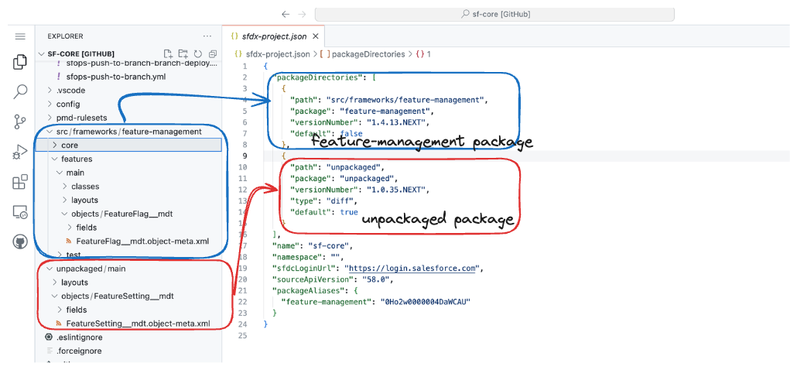

# Packages

Packages are containers used to group related metadata together.  A package would contain components such as objects, fields, apex, flows and more allowing these elements to be easily installed, upgraded and managed as a single unit\
\
Packages in the context of sfp are not limited to second generation packaging (2GP), sfp supports various types of packages which you can read in the following sections

<figure><figcaption>
Defining a package in repository
</figcaption></figure>

