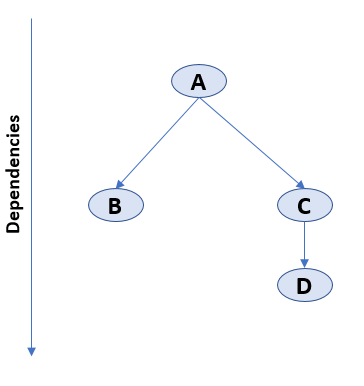
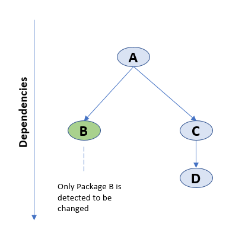

# Build Artifacts

sfp cli features an intuitive command to build artifacts of your packages in your repo. It can automatically understand the type of packages and build a new version of the artifact.   \


```
sfp orchestrator:build -v <devhub_name> --branch <value> 
```

sfp's build command  is  equipped with a diffcheck functionality, which is enabled when one utilizes **diffcheck** flag, A comparison (using git diff) is made between the latest source code and the previous version of the package published by the 'publish' command. If any difference is detected in the **package directory**, **package version** or **scratch org definition file** (applies to unlocked packages only), then the package will be created - otherwise, it is skipped.

## Determining Package to be built

These commands follow the order of the the packages as ordered in your sfdx-project.json. The commands also read your dependencies property, and then when triggered, will wait till all its dependencies are resolved, before triggering the package creation command.\
\
&#x20;For eg: provided the followings packages in sfdx-project.json along with its dependencies

**Scenario 1 : Build All**


<figure><figcaption></figcaption></figure>

1. Trigger creation of package A
2. Once A is completed, trigger creation of package B & C \*\*,\*\*using the version of A, created in step 1
3. Once C is completed, trigger creation of package

**Scenario 2 : Build with diffCheck enabled on a package with no dependencies**

<figure><figcaption></figcaption></figure>

In this scenario, where only a single package has changed and **diffCheck** is enabled, the build command will only trigger the creation of Package B

1. Trigger creation of package A
2. Once A is completed, trigger creation of package B & C \*\*,\*\*using the version of A, created in step 1
3. Once C is completed, trigger creation of package

**Scenario 3 : Build with diffCheck enabled on changes in multiple packages**


<figure><figcaption></figcaption></figure>

In this scenario, where there are changes in multiple packages, say B & C, the build command will trigger these packages in parallel, as their dependent package A has not changed (hence fulfilled). Please note even though there is a change in C, package D will not be triggered, unless there is an explicit version change of version number (major.minor.patch) of package D

## **Versioning Artifacts**


