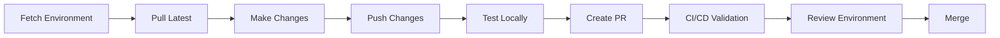

# Development Workflow

This guide walks through the complete development workflow using sfp in a modular Salesforce project following the Flxbl framework.

## Overview

The development workflow in an sfp-powered project follows an iterative approach where developers work in isolated environments, make changes using source-driven development, and submit their work through pull requests that trigger automated validation and review environments.



## Prerequisites

### DevHub Access Required

Before starting development with sfp, ensure you have:

1. **DevHub access** - Required for:
   - Building packages (all types)
   - Creating scratch orgs
   - Managing unlocked packages

2. **DevHub user setup**:
   - Your user must be added to the DevHub org
   - Follow Salesforce's guide: [Add DevHub License Users](https://developer.salesforce.com/docs/atlas.en-us.sfdx_dev.meta/sfdx_dev/sfdx_setup_add_free_license_users.htm)
   - Authenticate to your DevHub:
   ```bash
   sf org login web --alias mydevhub --set-default-dev-hub
   ```

3. **Verify DevHub connection**:
   ```bash
   # Check your DevHub connection
   sf org display --target-dev-hub
   ```

## 1. Starting a New Feature

### Fetch a Development Environment

Every feature or story begins with a developer fetching a fresh environment from a pre-prepared pool. The frequency depends on your team's practice:

- **Scratch Orgs**: Can be fetched for every story or feature
- **Sandboxes**: Typically fetched at the start of an iteration or sprint

#### Fetch from Scratch Org Pool (Community Edition - Local Pools)

```bash
# List available scratch orgs in pool (alias: pool:list)
sfp pool scratch list --tag dev-pool

# Fetch a scratch org from the pool (alias: pool:fetch)
sfp pool scratch fetch --tag dev-pool --alias my-feature-org

# Initialize a pool if empty (aliases: prepare, pool:prepare)
sfp pool scratch init --tag dev-pool \
  --targetdevhubusername mydevhub \
  --config config/project-scratch-def.json \
  --count 5
```

#### Fetch from Pool using sfp Server (sfp-pro - Server-Managed Pools)

```bash
# List available instances (works for both scratch orgs and sandboxes)
sfp server pool instance list \
  --repository myorg/myrepo \
  --tag dev-pool

# Fetch an org from the pool (scratch or sandbox)
sfp server pool instance fetch \
  --repository myorg/myrepo \
  --tag dev-pool \
  --assignment-id feature-123

# Extend org expiration if needed
sfp server pool instance extend \
  --repository myorg/myrepo \
  --tag dev-pool \
  --assignment-id feature-123 \
  --expiration-hours 48

# Unassign and return to pool when done
sfp server pool instance unassign \
  --repository myorg/myrepo \
  --tag dev-pool \
  --assignment-id feature-123
```

#### Create a New Sandbox (if needed)

```bash
# Create a new sandbox directly
sfp sandbox create --name feature-sandbox \
  --type Developer \
  --source-org production \
  --alias my-feature-sandbox
```

### Authenticate to Your Environment

Once you have your environment:

```bash
# Open the org to verify access (sfp-pro)
sfp org open --targetusername my-feature-org

# Open in a specific browser (sfp-pro)
sfp org open --targetusername my-feature-org --browser chrome

# For community edition, use Salesforce CLI
sf org open --target-org my-feature-org

# Set as default for convenience (sfp-pro)
sfp config set target-org my-feature-org

# Set globally (sfp-pro)
sfp config set target-org my-feature-org --global
```

## 2. Development Cycle

### Pull Latest Metadata

Before making changes, ensure you have the latest metadata from your org:

```bash
# Pull all changes from the org (using aliases: pull, source:pull, project:pull)
sfp pull --targetusername my-feature-org

# Pull with conflict resolution
sfp pull --targetusername my-feature-org --ignore-conflicts

# Pull a specific package
sfp pull --targetusername my-feature-org --package my-package

# Pull and see what replacements were reversed (sfp-pro)
sfp pull --targetusername my-feature-org --json
```

The pull command will:
- Retrieve metadata changes from your org
- Apply reverse text replacements to convert environment-specific values back to placeholders
- Update your local source files

### Make Your Changes

Now you can work on your feature using your preferred IDE:

1. **Modify existing metadata** in package directories
2. **Create new components** using SF CLI or your IDE
3. **Add new packages** if needed:

```bash
# Create a new source package (sfp-pro)
sfp package create source -n "feature-payment" \
  -r "src/payment-processing" \
  --domain

# Create an unlocked package
sfp package create unlocked -n "feature-payment" \
  -r "src/payment-processing" \
  -v mydevhub

# Create a data package
sfp package create data -n "reference-data" \
  -r "data/reference-data"

# For community edition, manually add to sfdx-project.json
```

4. **Organize packages** into logical groups using release configs (domains are conceptual, not explicit commands)

### Push Changes to Your Org

Deploy your local changes to the development org:

```bash
# Push all changes (using aliases: push, source:push, project:push)
sfp push --targetusername my-feature-org

# Push a specific package
sfp push --targetusername my-feature-org --package my-package

# Push ignoring conflicts
sfp push --targetusername my-feature-org --ignore-conflicts

# Push and see what replacements were applied (sfp-pro)
sfp push --targetusername my-feature-org --json
```

The push command will:
- Apply text replacements for environment-specific values
- Deploy metadata to your org
- Run tests if specified

### Build and Test Locally

#### Build Artifacts

Test that your packages can be built successfully:

```bash
# Build all packages (DevHub required)
sfp build --devhubalias mydevhub

# Build a specific domain
sfp build --devhubalias mydevhub --domain sales

# Build a specific package
sfp build --devhubalias mydevhub --package payment-processing

# Build with different options
sfp build --devhubalias mydevhub \
  --branch feature/payment \
  --buildnumber 123 \
  --diffcheck

# Note: DevHub is required even for source packages to resolve dependencies
```

#### Run Apex Tests

Execute tests in your development org to validate your changes. sfp follows a package-centric testing approach:

```bash
# Test a specific package (recommended)
sfp apextests trigger -o my-feature-org -l RunAllTestsInPackage -n sales-core

# Test all packages in a domain
sfp apextests trigger -o my-feature-org -l RunAllTestsInDomain \
  -r config/release-config.yaml

# Quick test during development
sfp apextests trigger -o my-feature-org -l RunSpecifiedTests \
  --specifiedtests PaymentProcessorTest

# Test with code coverage validation
sfp apextests trigger -o my-feature-org -l RunAllTestsInPackage \
  -n sales-core -c -p 80
```

For detailed information on test levels, coverage validation, output formats, and CI/CD integration, see [Running Apex Tests](running-apex-tests.md).

#### Install to Your Org (Optional)

While developers rarely need to install built artifacts to their own orgs, you can test the installation:

```bash
# Install a single package
sfp install --target-org my-feature-org \
  --artifacts artifacts \
  --package payment-processing

# Install with skip testing for faster deployment
sfp install --target-org my-feature-org \
  --artifacts artifacts \
  --skipifalreadyinstalled
```

## 3. Dependency Management

As you develop, you may need to manage package dependencies:

### Analyze Dependencies

```bash
# Understand package dependencies
sfp dependency explain --package payment-processing

# Expand all transitive dependencies (for troubleshooting)
sfp dependency expand --target-devhub mydevhub

# Clean up redundant dependencies
sfp dependency shrink --target-devhub mydevhub
```

## 4. Submitting Your Work

### Create a Pull Request

Once your feature is complete:

```bash
# Commit your changes
git add .
git commit -m "feat: implement payment processing module"

# Push to your feature branch
git push origin feature/payment-processing

# Create PR using GitHub CLI (optional)
gh pr create --title "Payment Processing Module" \
  --body "Implements new payment gateway integration"
```

### CI/CD Pipeline Takes Over

When you create a PR, the automated pipeline will:

1. **Run sfp validate** to verify your changes:

```bash
# This runs automatically in CI/CD
sfp validate org --target-org validation-org \
  --mode thorough \
  --coverageThreshold 75
```

2. **Create a review environment** for acceptance testing:

```bash
# CI/CD creates an ephemeral environment
sfp pool scratch fetch --pool review-pool \
  --alias pr-123-review

# Install the changes
sfp install --target-org pr-123-review \
  --artifacts artifacts
```

3. **Run quality checks**:
   - Code coverage validation
   - Dependency validation
   - Package structure verification

### Review Environment Testing

The review environment URL is posted to your PR for stakeholders to test:

- Product owners can validate functionality
- QA can run acceptance tests
- Other developers can review the implementation

## 5. Post-Merge

After your PR is approved and merged:

1. **Artifacts are built** from the main branch
2. **Published to artifact repository**
3. **Ready for release** to higher environments

```bash
# This happens automatically in CI/CD
sfp build --branch main
sfp publish --artifacts artifacts \
  --npm-registry https://your-registry.com
```

## Common Workflows

### Working with Aliasified Packages

When working with environment-specific metadata:

```bash
# Pull from a specific environment
sfp pull --targetusername dev-sandbox

# The correct variant is automatically selected
# src-env-specific/main/dev/* contents are used
```

### Using Text Replacements

For configuration values that change per environment:

```yaml
# Create preDeploy/replacements.yml in your package
replacements:
  - name: "API Endpoint"
    glob: "**/*.cls"
    pattern: "%%API_URL%%"
    environments:
      default: "https://api.dev.example.com"
      prod: "https://api.example.com"
```

Then push/pull will automatically handle replacements:

```bash
# Push replaces placeholders with environment values
sfp push --targetusername my-feature-org

# Pull reverses replacements back to placeholders
sfp pull --targetusername my-feature-org
```

### Handling Destructive Changes

When you need to delete metadata:

1. Move components to `pre-destructive/` or `post-destructive/` folders
2. Push changes normally:

```bash
sfp push --targetusername my-feature-org
```

The destructive changes are automatically processed.

## Troubleshooting

### Pool is Empty

#### Community Edition (Local Pools)
```bash
# Check pool status
sfp pool scratch list --tag dev-pool

# Replenish the pool (aliases: prepare, pool:prepare)
sfp pool scratch init --tag dev-pool \
  --targetdevhubusername mydevhub \
  --count 5
```

#### sfp-pro (Server-Managed Pools)
```bash
# Check pool status
sfp server pool status --repository myorg/myrepo --tag dev-pool

# Replenish pool (works for both scratch orgs and sandboxes)
sfp server pool replenish \
  --repository myorg/myrepo \
  --tag dev-pool
```

### Push/Pull Conflicts

```bash
# Ignore conflicts during pull
sfp pull --targetusername my-feature-org --ignore-conflicts

# Ignore conflicts during push
sfp push --targetusername my-feature-org --ignore-conflicts
```

### Build Failures

```bash
# Check for issues in specific package
sfp build --devhubalias mydevhub \
  --package problematic-package \
  --loglevel DEBUG

# Validate dependencies
sfp dependency explain --package problematic-package
```

### DevHub Connection Issues

```bash
# Re-authenticate to DevHub
sf org login web --alias mydevhub --set-default-dev-hub

# Verify DevHub is enabled
sf org display --target-dev-hub

# Check DevHub limits
sf limits api display --target-org mydevhub
```