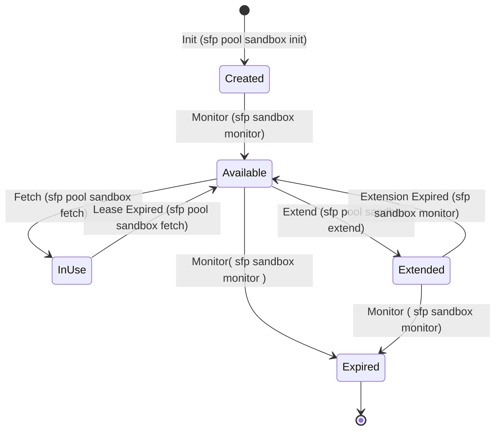

# Sandbox Pools

|              | sfp-pro      | sfp (community) |
| ------------ | ------------ | --------------- |
| Availability | ✅            | ❌               |
| From         | September 24 |                 |

Sandbox pools in sfp are designed to provide instantly available Salesforce environments for development, testing, and review processes. By maintaining a pool of pre-created sandboxes, teams can significantly reduce wait times and streamline their development workflows.

### Key Benefits

1. **Immediate Availability**: Eliminate waiting times for sandbox creation, allowing developers to start work instantly.
2. **Reduced Overhead**: Minimize the administrative burden of creating and managing individual sandboxes for each task.
3. **Consistent Environment**: Ensure all team members work with standardized, pre-configured sandbox environments.
4. **Seamless Integration**: Easily incorporate sandbox allocation into automated CI/CD pipelines and development workflows.


### Sandbox Lifecycle

The following diagram illustrates the lifecycle of a sandbox within a pool:




### Commands Overview

#### 1. Sandbox Pool Initialization

```
sfp pool sandbox init -f <path/to/config-file> -v <devhub-alias> -r <owner/repo>
```

Initializes sandbox pools based on configuration files.

#### 2. Fetch a Sandbox

```
sfp pool sandbox fetch --repository <owner/repo> --pool <pool-name> --branch <branch-name> --issue <issue-number> [--devhubalias <alias>] [--wait <minutes>] [--leasefor <minutes>]
```

Fetches an available sandbox from a pool and assigns it to an issue.

#### 3. Monitor Sandbox Pools

```
sfp sandbox monitor -v <devhub-alias> -r <owner/repo> -f <path/to/config-file> [<path/to/config-file>...]
```

Monitors sandbox status, handles activations, expirations, and deletions.

### Continuous Monitoring

The `sfp sandbox monitor` command is designed to be run as a continuous cron job. This ensures that:

1. Newly created sandboxes are activated promptly.
2. Expired sandboxes are identified and marked for deletion.
3. Marked sandboxes are deleted, freeing up resources.
4. The pool is kept in a healthy state, always ready for use.

It's recommended to set up this command to run at regular intervals (e.g., every 15-30 minutes) to maintain an up-to-date and efficient sandbox pool.

For detailed information on each command and the expiration process, please refer to the individual command documentation.
