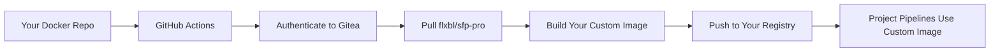

# Migration Quick Start Guide
## sfp-comm to sfp-pro Migration

> This guide provides step-by-step instructions for migrating from sfp-comm to sfp-pro.

---

## 🎯 Migration Overview



Current: `sfp-comm` → Target: `sfp-pro:49.0.0-16849478288`

---

## 🔐 Step 1: Gitea Authentication Setup

> We'll create a Personal Access Token (PAT) to authenticate with Flxbl's container registry and add it to your GitHub repository secrets.

### Generate Personal Access Token (PAT)

1. **Navigate to Gitea**
   ```
   URL: https://source.flxbl.io
   ```

2. **Create PAT**
   - Go to: Settings → Applications → Personal Access Tokens
   - Name: `docker-build` (or any name)
   - Permissions: `read:package` (minimum)
   - **IMPORTANT**: Copy token immediately (shown only once!)

3. **Add Secrets to GitHub Repository**
   - Go to your Docker build repository
   - Settings → Secrets and variables → Actions
   - Add new repository secrets:
     - `GITEA_USER`: Your Gitea username
     - `GITEA_PAT`: The PAT token you just created

---

## 🐳 Step 2: GitHub Actions Integration

> Add these snippets to your existing GitHub Actions workflow for building Docker images.

### Key Snippets to Add:

#### 1. Environment Variables (add to `env:` section)
```yaml
env:
  SFP_VERSION: 49.0.0-16849478288  # Get specific version from link below
```

> **📌 Finding the Version:**
> - Browse available versions at: https://source.flxbl.io/flxbl/-/packages/container/sfp-pro/versions
> - **Always use a specific version tag** (e.g., `49.0.0-16849478288`)
> - **Avoid `latest` tag** - Major versions may contain breaking changes
> - **Check release notes** before upgrading to ensure compatibility with your workflows

#### 2. Authentication & Pull Steps (add before your build step)
```yaml
      - name: Login to Gitea (source.flxbl.io)
        run: |
          echo "${{ secrets.GITEA_PAT }}" | docker login source.flxbl.io \
            -u ${{ secrets.GITEA_USER }} \
            --password-stdin

      - name: Pull sfp-pro base image
        run: |
          SFP_VERSION="${{ github.event.inputs.sfp_version || env.SFP_VERSION }}"
          BASE_IMAGE="source.flxbl.io/flxbl/sfp-pro:${SFP_VERSION}"
          docker pull ${BASE_IMAGE}
          echo "BASE_IMAGE=${BASE_IMAGE}" >> $GITHUB_ENV
```

#### 3. Build Arguments (choose your approach)

**Option A: Dynamic base image (recommended)**
```yaml
      - name: Build your custom Docker image
        run: |
          docker build \
            --build-arg BASE_IMAGE=${{ env.BASE_IMAGE }} \
            -f Dockerfile \
            -t your-custom-image:latest \
            .
```

**Option B: Use docker/build-push-action**
```yaml
      - name: Build your custom Docker image
        uses: docker/build-push-action@v5
        with:
          context: .
          push: true
          tags: your-registry/your-image:latest
          build-args: |
            BASE_IMAGE=${{ env.BASE_IMAGE }}
```

---

## 📝 Step 3: Update Your Dockerfile

> Your Dockerfile needs to accept the base image as an argument.

### Dockerfile Changes:

```dockerfile
# Add at the very top of your existing Dockerfile
ARG BASE_IMAGE=source.flxbl.io/flxbl/sfp-pro:49.0.0-16849478288
FROM ${BASE_IMAGE}

# All your existing customizations remain below...
```

**Note:** The `ARG` line provides a default value if no build argument is passed, but the GitHub Actions workflow will override it with the version you specify.

---

## ✅ Step 4: Command Verification

> After building, verify critical commands work in your custom image.

### Quick Test:
```bash
docker run --rm YOUR_IMAGE bash -c "sfp --version"
```

Expected output:
- `sfp --version`: 49.0.0

### Critical Commands to Verify:

| Command | Must Work | Notes |
|---------|-----------|-------|
| `sfp build` (alias: `orchestrator:build`) | ✅ | Pro adds `--commit` flag |
| `sfp install` | ✅ | Core functionality unchanged |
| `sfp publish` | ✅ | Core functionality unchanged |
| `sfp release` | ✅ | Core functionality unchanged |

### ⚠️ Command Compatibility: sfp-comm vs sfp-pro

**New/Changed in sfp-pro:**
- **`--commit` flag** added to `build` command for specifying commit hash
- **Server flags** added to most commands (`--server-url`, `--api-key`)
- **Additional commands** in pro: `server:*`, `dev:*`, `project:*`, `sandbox:*`
- **Orchestrator alias**: Both versions support `sfp orchestrator:build` as alias for `sfp build`

**Migration Notes:**
- All core orchestrator commands (`build`, `install`, `publish`, `release`) work identically
- Existing pipelines using these commands will continue to work
- New flags are optional and backward compatible

---

## 🚨 Quick Fixes

### **Auth Failed:**
```bash
# Regenerate token and retry
docker logout source.flxbl.io
echo "NEW_PAT" | docker login source.flxbl.io -u USERNAME --password-stdin
```

### **Network Timeout:**
```yaml
# Add retry to your workflow
- uses: nick-fields/retry@v2
  with:
    max_attempts: 3
    timeout_minutes: 5
    command: docker pull source.flxbl.io/flxbl/sfp-pro:49.0.0-16849478288
```

---

## 📞 Support

For assistance with migration:
- Slack: #sfp-pro-support
- Email: support@flxbl.io

---

**Last Updated**: January 2025