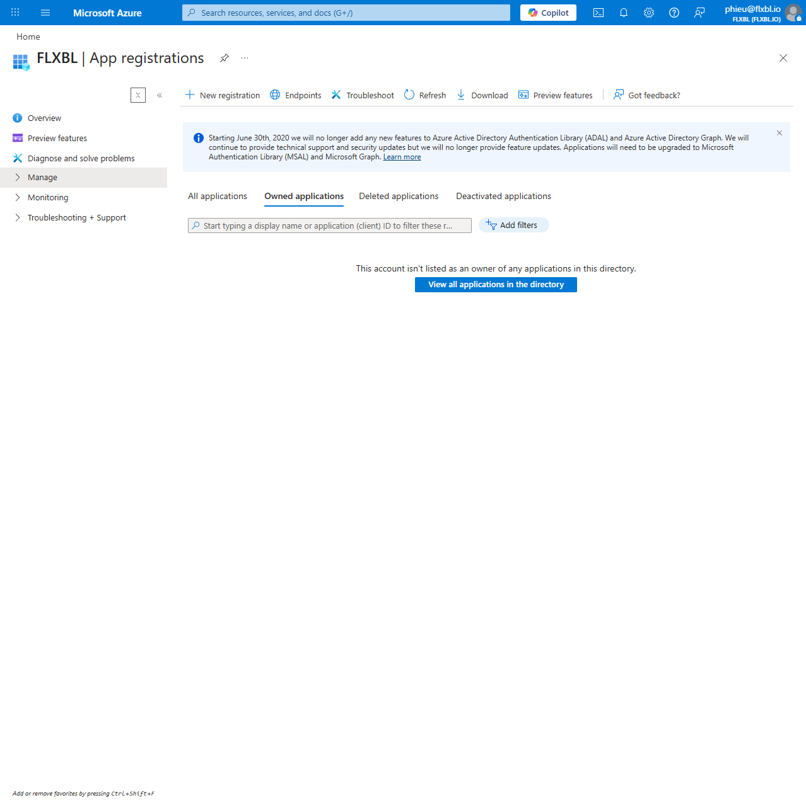
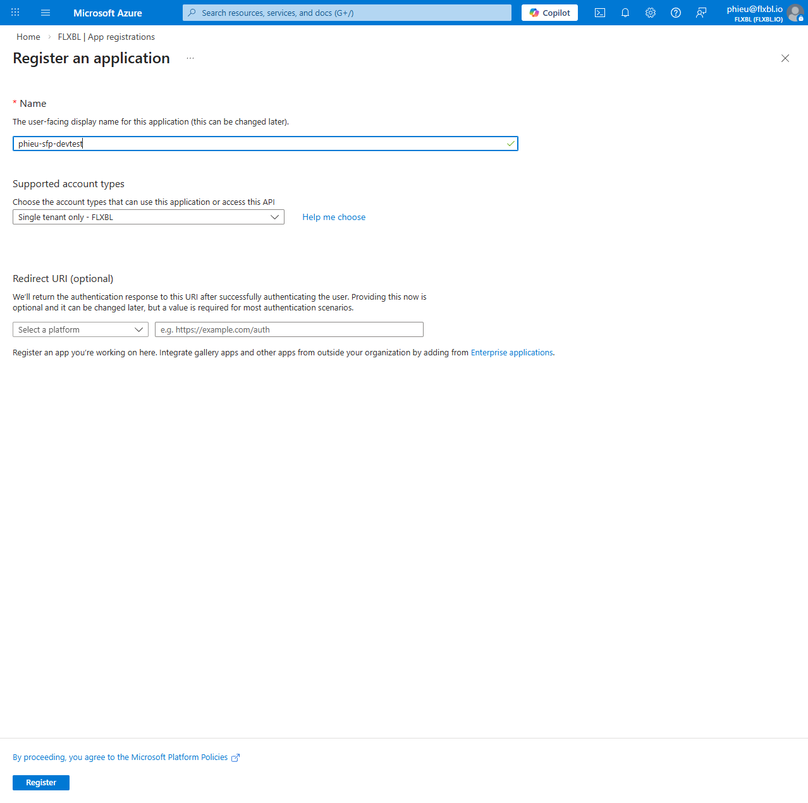
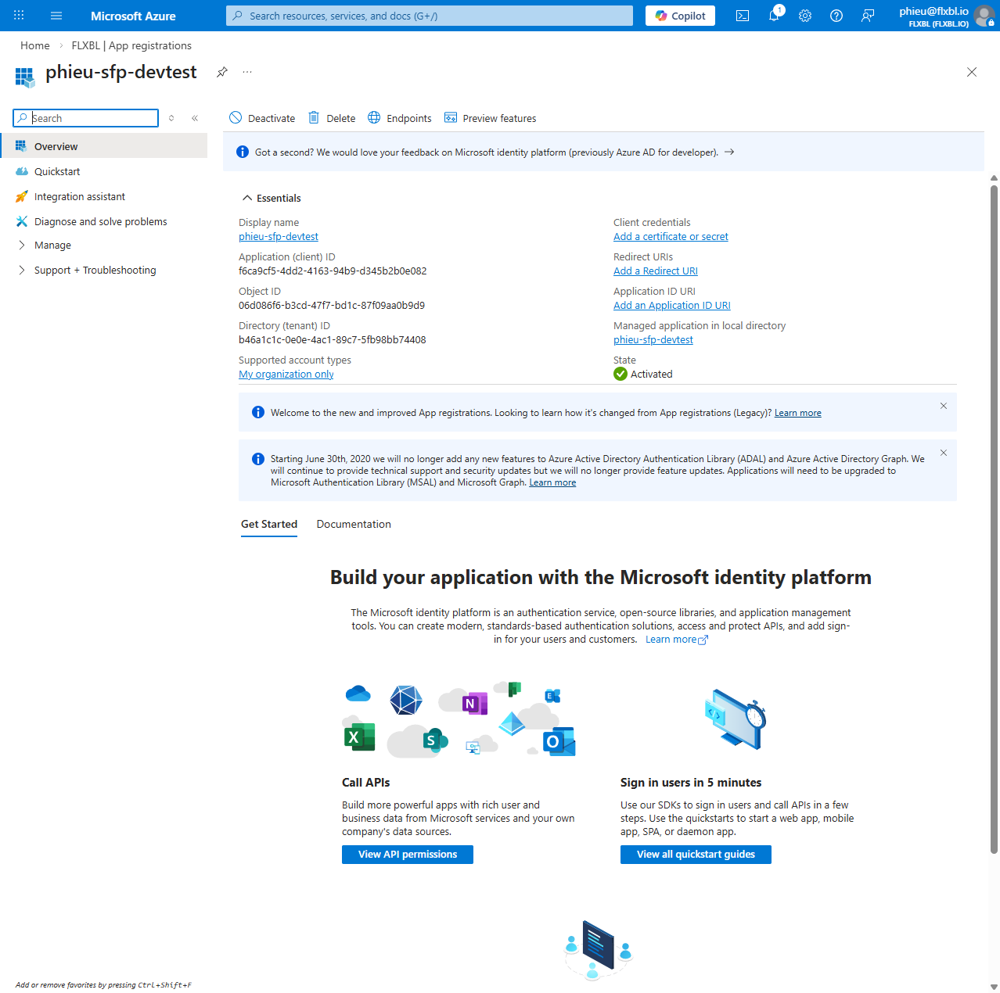
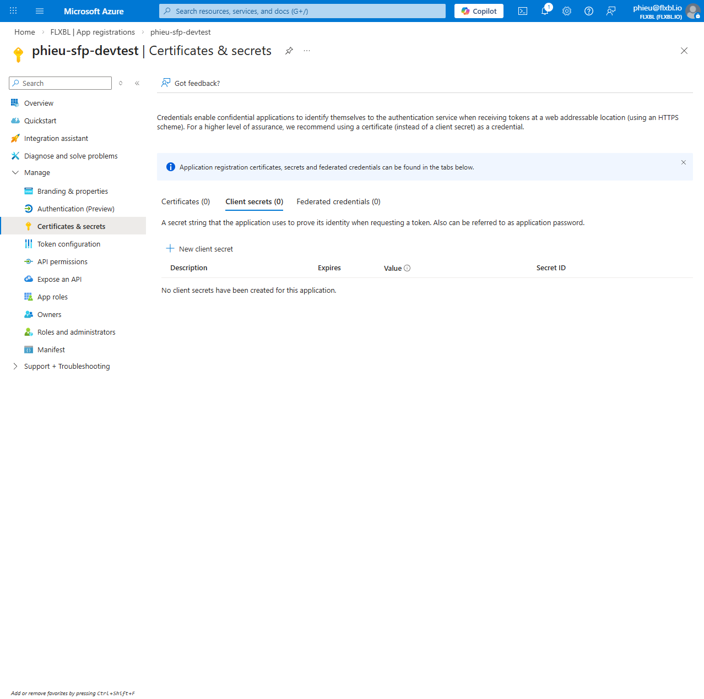
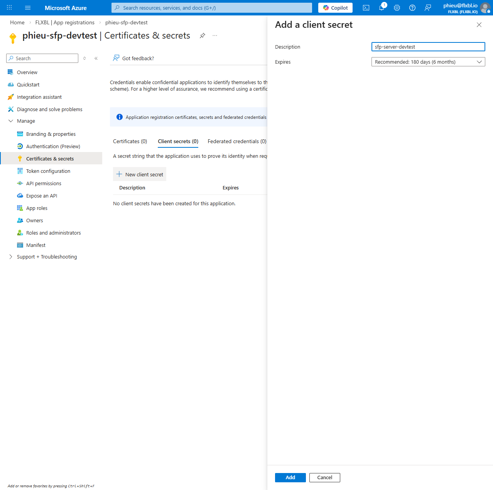
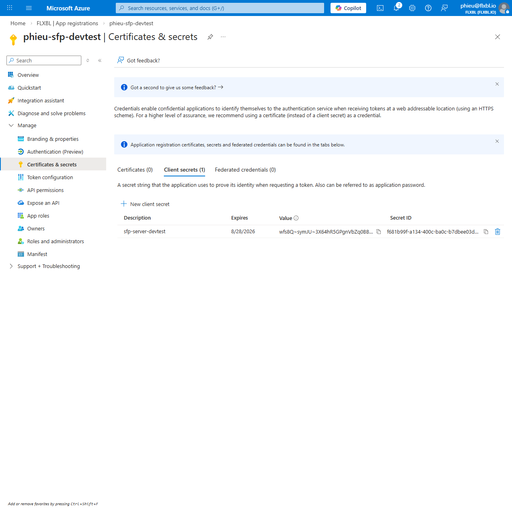
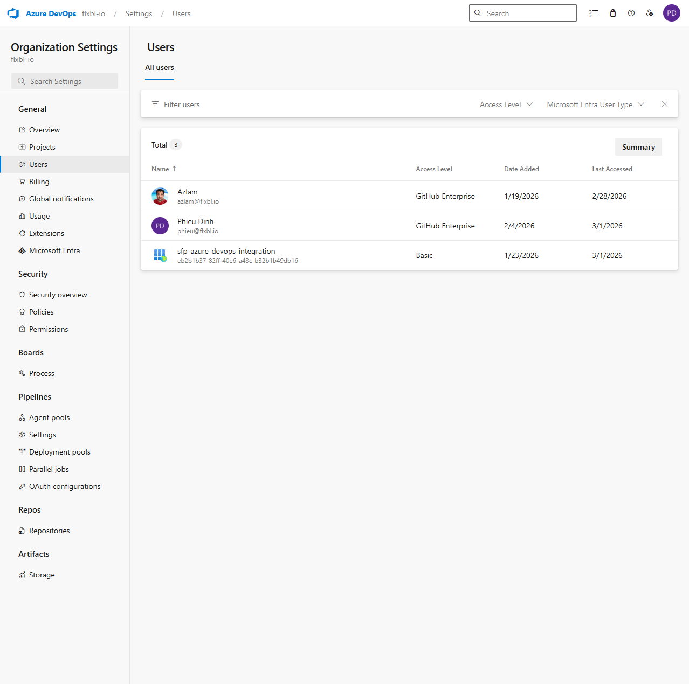

# Azure DevOps

## Overview

Azure DevOps integration enables sfp to connect to your Azure DevOps (ADO) repositories. This supports automated build triggering on pushes and pull requests, work item creation and updates, and release candidate management across environments.

sfp resolves credentials dynamically during operations, supporting both project-scoped and global configurations.

## Authentication Methods

### Service Principal (Recommended)

Service Principals use Azure Entra ID (formerly Azure AD) application registration with the client credentials OAuth flow. 

Advantages include:
- No manual token rotation; secrets have configurable expiry (up to 24 months).
- Scoped permissions via ADO access levels and project roles.
- Centralized audit trail through Entra ID logs.
- Suitable for CI/CD and shared team access.

### Personal Access Token (PAT)

PATs are user-scoped tokens generated in ADO. Setup is simpler but tokens expire (default 90 days, max 1 year) and are tied to individual accounts.

Use PATs for personal testing or when Service Principal setup is not feasible.

## Setting Up a Service Principal

### Prerequisites

- Access to Azure Portal with Entra ID permissions to register applications.
- Azure DevOps organization administrator access to add the Service Principal as a user.

### Step 1: Register an Application in Azure Entra ID

1. Sign in to the [Azure Portal](https://portal.azure.com).
2. Navigate to **Microsoft Entra ID** > **App registrations**.
3. Select **New registration**.

<figure>

<figcaption><p>Entra ID App registrations page</p></figcaption>
</figure>

4. Complete the registration form with a descriptive name (e.g., `sfp-service-principal`).

<figure>

<figcaption><p>New app registration form</p></figcaption>
</figure>

<figure>

<figcaption><p>App registration form completed</p></figcaption>
</figure>

5. Select **Register**.

### Step 2: Note Application Credentials

From the app overview page, copy the **Application (client) ID** and **Directory (tenant) ID**.

<figure>

<figcaption><p>Application credentials from overview page</p></figcaption>
</figure>

### Step 3: Create a Client Secret

1. In the app, navigate to **Certificates & secrets** > **Client secrets** > **New client secret**.

<figure>

<figcaption><p>Certificates & secrets navigation</p></figcaption>
</figure>

2. Add a description, set an expiry (recommend 12-24 months), and select **Add**.

<figure>

<figcaption><p>New client secret configuration</p></figcaption>
</figure>

3. **Immediately copy the secret Value**. It is shown only once.

<figure>

<figcaption><p>Client secret value (copy immediately)</p></figcaption>
</figure>

### Step 4: Add Service Principal to Azure DevOps

1. Sign in to your Azure DevOps organization.
2. Navigate to **Organization settings** > **Users** > **Add users**.

<figure>

<figcaption><p>ADO organization users management</p></figcaption>
</figure>

3. Enter the **Application (client) ID** as the user identifier.
4. Assign at least **Basic** access level.
5. Grant project permissions as needed (e.g., Contributor for builds and work items).

## Registering the Integration in sfp

### Via codev Desktop App

1. Open codev and navigate to **Settings** > **Integrations**.
2. Click **Add Integration** and select **Azure DevOps**.
3. Choose **Service Principal** authentication.
4. Enter **Application ID**, **Tenant ID**, and **Client Secret**.
5. Select scope: project-specific (enter repository identifier) or global.
6. Save the integration.

### Via API

```bash
curl -X POST 'https://your-sfp-server/sfp/api/integrations' \
  -H 'Authorization: Bearer $YOUR_JWT_TOKEN' \
  -H 'Content-Type: application/json' \
  -d '{
    "provider": "azuredevops",
    "authType": "service_principal",
    "credentials": {
      "app_id": "your-application-client-id",
      "password": "your-client-secret",
      "tenant": "your-directory-tenant-id"
    },
    "isGlobal": true,
    "project": "your-ado-project"  // Omit for global
  }'
```

Replace `$YOUR_JWT_TOKEN` with a valid sfp server JWT.

## How Credential Resolution Works

sfp resolves credentials during operations via this chain:

1. **Project-scoped**: Checks `sfp_integrations` for entries matching the target project/repository.
2. **Global/default**: Falls back to `isGlobal: true` integrations.
3. **Failure**: Returns 404 if no matching credentials found.

This ensures project-specific credentials take precedence while providing safe defaults.

## Setting Up a Personal Access Token

1. In Azure DevOps, navigate to **User settings** > **Personal access tokens** > **New Token**.
2. Set a description and expiry.
3. Select scopes: **Code (Read & Write)**, **Work Items (Read & Write)**, **Build (Read & Execute)**.
4. Copy the generated token.
5. Register via codev UI (select **PAT** auth type) or API:

```bash
curl -X POST 'https://your-sfp-server/sfp/api/integrations' \
  -H 'Authorization: Bearer $YOUR_JWT_TOKEN' \
  -H 'Content-Type: application/json' \
  -d '{
    "provider": "azuredevops",
    "authType": "pat",
    "credentials": {
      "token": "your-pat-token"
    },
    "isGlobal": true
  }'
```

## Troubleshooting

| Issue | Cause | Resolution |
|-------|-------|------------|
| `Invalid client credentials` | Mismatched ID/secret/tenant or expired secret | Verify values in Entra ID; regenerate secret if expired |
| `Insufficient privileges to complete operation` | Service Principal lacks ADO access | Confirm SP added as user with Basic+ access and project roles |
| `No integration found for project` | Missing or mis-scoped integration | Add project-scoped entry or fallback global integration |
| `401 Unauthorized` (PAT) | Expired or insufficient scopes | Regenerate PAT with required scopes (Code R/W, Work Items R/W, Build R/E) |
| Token expiry | Client secret or PAT reached end-of-life | Rotate before expiry; set calendar reminders for secrets up to 24 months |

For API errors, check server logs via `docker logs sfp-pro-server-1`. Contact support with request ID if issues persist.