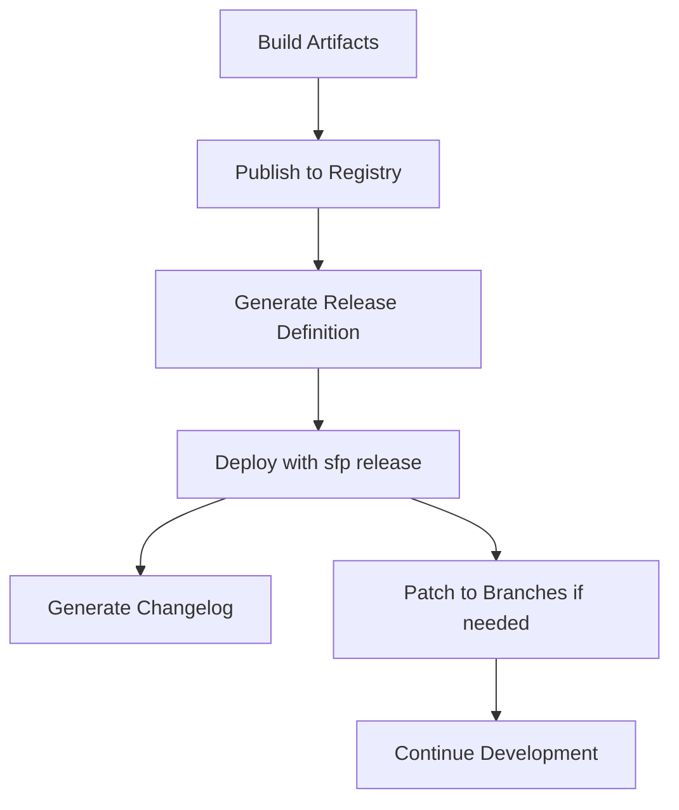

# Overview

## The Release Process

In an sfp-powered project, releasing involves orchestrating the deployment of multiple artifacts (built packages) to target environments in a controlled, repeatable manner. The release process ensures consistency, traceability, and reliability across your Salesforce environments.

## Key Components

### Release Definition
A YAML file that specifies:
- Which artifacts (packages and versions) to deploy
- The release name and configuration
- Deployment behavior (skip if installed, promotion settings)
- Changelog generation settings

### Release Commands

sfp provides several commands for managing releases:

| Command | Purpose | Use Case |
|---------|---------|----------|
| `sfp release` | Deploy artifacts to an org | Production deployments, environment updates |
| `sfp releasedefinition:generate` | Create release definition from artifacts | Automated release preparation |
| `sfp repo:patch` | Apply release to a branch | Hotfixes, branch synchronization |
| `sfp changelog generate` | Generate release changelog | Documentation, compliance |

## Release Workflow



### 1. Build and Publish Phase

After code is merged to your main branch:

```bash
# CI/CD builds artifacts
sfp build --branch main

# Publish to artifact registry
sfp publish --npm --scope mycompany
```

### 2. Release Definition Generation

Create a release definition for your target environment:

```bash
sfp releasedefinition:generate \
  --gitref main \
  --releaseconfig config/release-config-prod.yaml \
  --releasename "Release-2.0.0" \
  --directory releases
```

### 3. Deployment Phase

Deploy the release to your target environment:

```bash
sfp release \
  --path releases/Release-2.0.0.yaml \
  --targetusername production \
  --npm --scope mycompany
```

### 4. Post-Release Activities

After a successful release:

```bash
# Generate changelog
sfp changelog generate \
  --releasename "Release-2.0.0" \
  --directory changelog

# Patch release back to development (if needed)
sfp repo:patch \
  --releasedefinitions releases/Release-2.0.0.yaml \
  --sourcebranchname develop \
  --targetbranchname feature/sync-prod-release
```

## Release vs Install

sfp provides two deployment commands with different use cases:

### sfp install
- Installs artifacts from a local directory
- Used for development and testing
- Direct, simple deployment
- Example:
```bash
sfp install --artifacts ./artifacts --targetusername myorg
```

### sfp release
- Fetches artifacts from a registry
- Uses release definitions for consistency
- Generates changelogs
- Handles complex multi-artifact deployments
- Example:
```bash
sfp release --path release.yaml --targetusername prod --npm
```

## Release Strategies

### Progressive Deployment

Deploy through environments progressively:

```bash
# 1. Deploy to UAT
sfp release --path release-uat.yaml --targetusername uat

# 2. Validate in UAT
# ... testing ...

# 3. Deploy to Production
sfp release --path release-prod.yaml --targetusername prod
```

### Hotfix Strategy

For urgent production fixes:

```bash
# 1. Patch production state to hotfix branch
sfp repo:patch \
  --releasedefinitions current-prod-release.yaml \
  --sourcebranchname main \
  --targetbranchname hotfix/urgent

# 2. Make fixes and build
sfp build --branch hotfix/urgent

# 3. Release hotfix
sfp release --path hotfix-release.yaml --targetusername prod

# 4. Sync hotfix back to develop
sfp repo:patch \
  --releasedefinitions hotfix-release.yaml \
  --sourcebranchname develop \
  --targetbranchname feature/hotfix-sync
```

### Rollback Strategy

Prepare for potential rollbacks:

```bash
# Before release, save current state
sfp releasedefinition:generate \
  --gitref main \
  --releasename "rollback-snapshot" \
  --directory rollbacks

# If rollback needed
sfp release \
  --path rollbacks/rollback-snapshot.yaml \
  --targetusername prod
```

## Domain-Based Release Configuration

sfp uses [Release Configs](../configuring-a-project/release-config.md) to organize packages by domain. These configs define which packages belong to a domain and control various aspects of the release process:

```yaml
# config/release-config-sales.yaml
releaseName: sales
pool: sales_pool
includeOnlyArtifacts:
  - src-sales-core
  - src-sales-ui
  - src-opportunity-management
  - src-lead-scoring
excludePackageDependencies:
  - Marketing Cloud
releasedefinitionProperties:
  changelog:
    workItemFilters:
      - SALES-[0-9]{3,4}
    workItemUrl: https://company.atlassian.net/browse
    limit: 30

# config/release-config-service.yaml
releaseName: service
pool: service_pool
includeOnlyArtifacts:
  - src-service-core
  - src-case-management
  - src-knowledge-base
  - src-service-console
```

Key points about release configs:
- They define **domains** (logical groupings of packages), not environments
- Packages must be **explicitly listed** in `includeOnlyArtifacts`
- The same domain configuration is used across all environments (dev, uat, prod)
- They control validation pools, changelog generation, and deployment behavior

The release definition generated from these configs determines which versions of packages are deployed to each environment.

