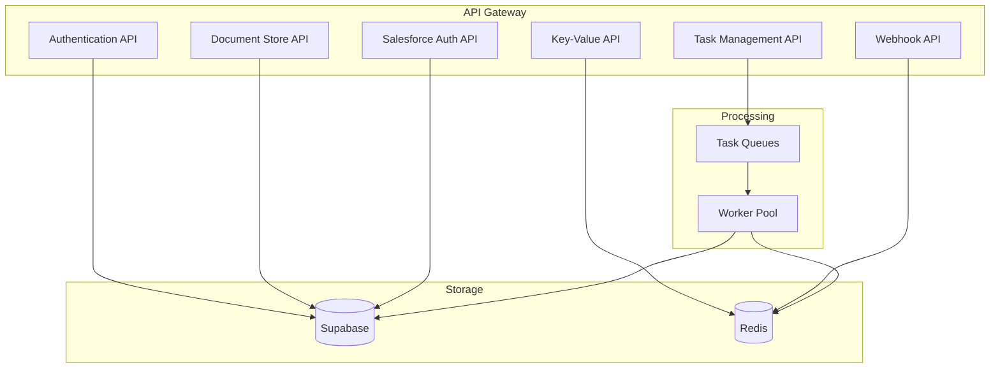
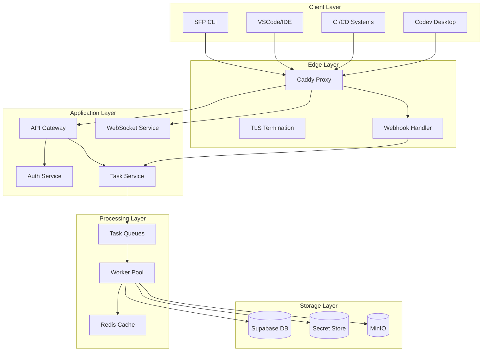
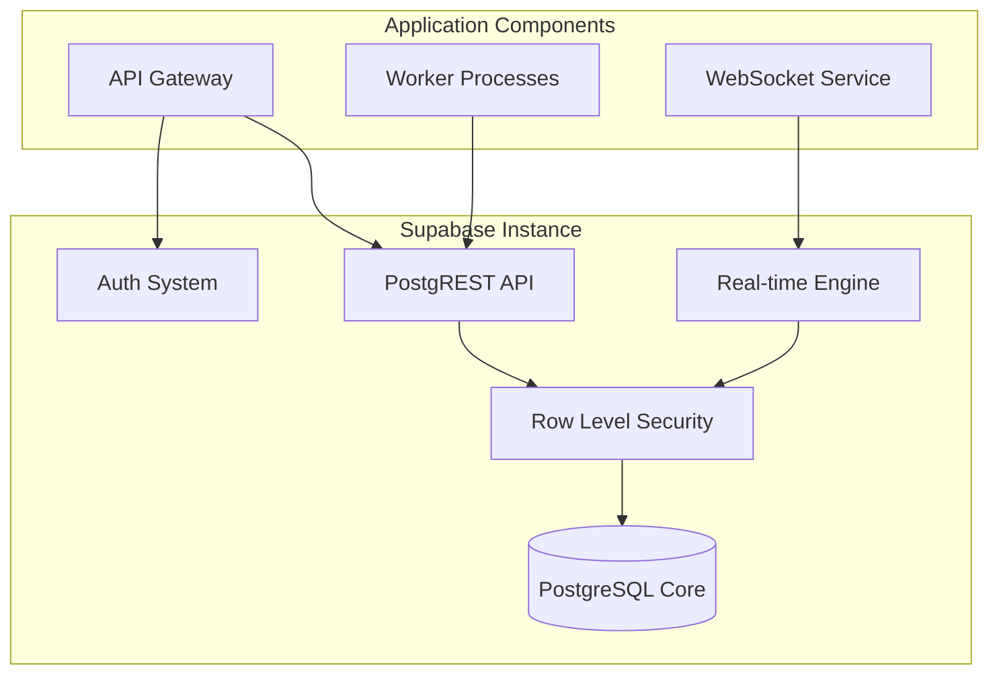
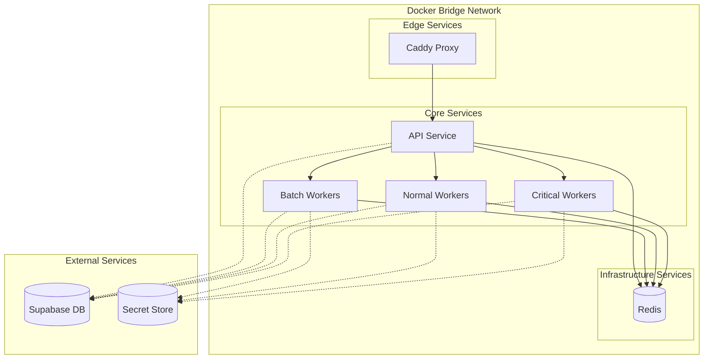
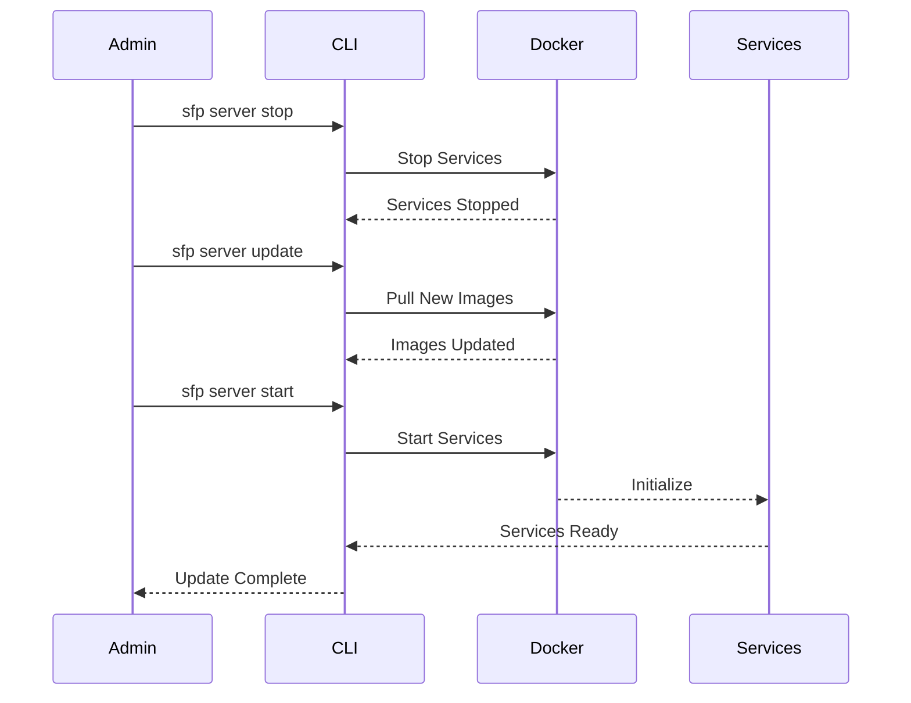
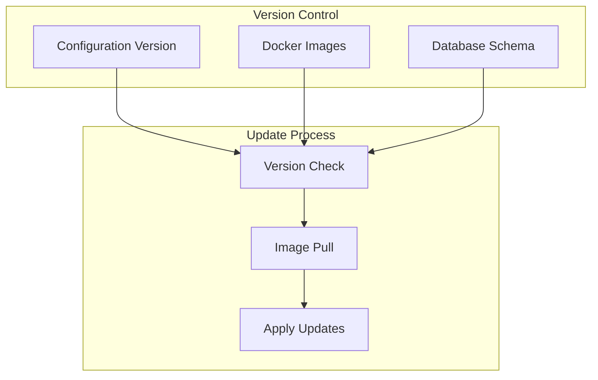
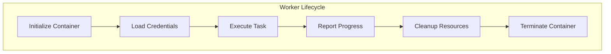
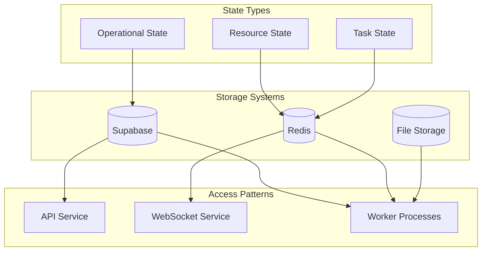

# sfp-pro-server: Architecture Overview

## Introduction

SFP Pro Server represents a significant evolution in Salesforce DevOps automation, transitioning from distributed command-line tooling to an enterprise-grade server architecture. The system provides a comprehensive REST API that enables sophisticated DevOps automation while maintaining strict security boundaries and operational isolation.

### Core Architectural Principles

The architecture of SFP Pro Server is built upon three fundamental principles that guide every aspect of its design:

1. Complete Instance Isolation: Each organization operates in its own dedicated compute instance with its own resources, ensuring complete separation of operations, data, and processing. This isolation isn't merely logical—it's physical separation at the infrastructure level.
2. Ephemeral Processing Model: All operations execute in single-use worker processes that maintain no state between executions. Each worker initializes with a clean environment, receives just-in-time credentials, and terminates after task completion, ensuring complete isolation between operations.
3. Real-time State Management: The system maintains centralized state management through Supabase, enabling real-time visibility into operations while ensuring state consistency and security. This replaces traditional Git-based state tracking with a more robust, real-time approach.

### Service Architecture

The SFP Pro Server implements a layered service architecture that exposes capabilities through well-defined API endpoints:

#### Authentication Services

The authentication system provides OAuth-based authentication with support for both interactive users and application tokens. Key capabilities include:

* OAuth callback handling for social authentication
* Application token management for CI/CD systems
* Role-based access control
* Session management

#### Task Processing System

The system implements a sophisticated task queue with priority levels:

* Critical tasks for time-sensitive operations
* Normal tasks for standard development operations
* Batch tasks for resource-intensive processes

Tasks can be submitted with specific scheduling requirements:

* Immediate execution
* Scheduled execution at a future time
* Recurring execution with configurable intervals

#### Document Store

The system provides a sophisticated document store with collection support:

* Hierarchical document organization
* Version tracking for all documents
* Optimistic concurrency control
* Cross-collection querying capabilities

#### Key-Value Store

A simple key-value store provides fast access to operational data:

* Atomic operations
* Versioned updates
* Flexible value storage

#### Salesforce Authentication

The system implements comprehensive Salesforce credential management:

* Production org registration and validation
* Sandbox authentication handling
* Credential security through ephemeral access
* Connection testing capabilities

#### Webhook System

A flexible webhook system enables integration with external systems:

* Multiple provider support
* Configurable retry policies
* Filtered event delivery
* Real-time delivery tracking

### API Structure

The API is organized into logical service groups, each handling specific aspects of the system:



Each API group implements specific security controls and maintains its own service boundaries while operating within the overall system architecture.

### System Architecture Overview

The complete system architecture implements multiple layers of functionality and security:



Each layer serves a specific purpose in the architecture:

The Edge Layer handles all external communication, implementing TLS termination, request routing, and basic security controls. This layer ensures that all communication is encrypted and properly authenticated before reaching internal services.

The Application Layer contains the core services that manage authentication, task orchestration, and real-time updates. These services operate in isolated networks with controlled access to the processing and storage layers.

The Processing Layer manages task execution through worker processes that operate in complete isolation. This layer implements sophisticated queue management and worker lifecycle controls to ensure secure and efficient task processing.

The Storage Layer maintains system state and data through multiple specialized systems. Supabase provides the primary database and real-time capabilities, while MinIO handles file storage and a dedicated secret store manages sensitive credentials.

### Why Supabase?

The selection of Supabase as our database platform represents a strategic architectural decision that extends beyond basic data storage capabilities. Supabase provides several crucial features that are fundamental to our architecture:

Real-time State Management: Supabase's real-time engine enables sophisticated state synchronization across system components. When a deployment status changes or a task completes, all relevant components receive immediate updates. This capability is crucial for maintaining accurate operational state across distributed system components.

Row-Level Security: While we implement complete instance isolation, Supabase's row-level security provides an additional layer of protection. This defense-in-depth approach ensures that even in the hypothetical case of a security boundary breach, the database enforces strict access controls.

Authentication Integration: Supabase's authentication capabilities integrate seamlessly with our OAuth architecture while maintaining complete instance isolation. This includes sophisticated token management, session handling, and security policy enforcement.



### Deployment Architecture

#### Instance Isolation Model

SFP Pro Server provides two deployment models: FLXBL-managed and self-managed instances. In both cases, each organization receives a dedicated compute instance (AWS EC2, Azure VM, or Hetzner Server) with a minimum of 8GB RAM, running a complete Docker Compose-based deployment of the platform.

The system deploys as a collection of Docker containers that implement the complete API surface and processing capabilities:

````mermaid
graph TD
    subgraph "Cloud Instance"
        subgraph "Edge Layer"
            Caddy[Caddy Proxy]
            TLS[TLS Termination]
        end

        subgraph "API Services"
            API[API Gateway]
            Auth[Auth Service]
            Tasks[Task Service]
            Docs[Document Service]
        end

        subgraph "Processing"
            Queue[Task Queues]
            CriticalW[Critical Workers]
            NormalW[Normal Workers]
            BatchW[Batch Workers]
        end

        subgraph "Storage"
            Redis[(Redis)]
            Files[(File Storage)]
        end
    end

    subgraph "External Services"
        Supabase[(Supabase DB)]
        Secrets[(Secret Store)]
    end

    Caddy --> API
    API --> Auth
    API --> Tasks
    API --> Docs

    Tasks --> Queue
    Queue --> CriticalW
    Queue --> NormalW
    Queue --> BatchW

    CriticalW --> Redis
    NormalW --> Redis
    BatchW --> Redis

    Auth --> Supabase
    Docs --> Supabase
    Tasks --> Supabase


### Authentication Architecture

The authentication architecture implements different patterns for FLXBL-managed and self-managed deployments while maintaining consistent API interfaces:

FLXBL-Managed Authentication:
```mermaid
graph TD
    subgraph "FLXBL Global Services"
        GA[OAuth Callback Handler]
        Apps[FLXBL Social Apps]
    end

    subgraph "Organization Instance"
        subgraph "Edge Layer"
            CP[Caddy Proxy]
            TLS[TLS Termination]
        end

        subgraph "Auth Services"
            Auth[Auth Service]
            Token[Token Manager]
            RBAC[Role Manager]
        end
    end

    GA --> CP
    CP --> Auth
    Auth --> Token
    Token --> RBAC
````

In FLXBL-managed deployments, the global OAuth callback service handles authentication with social providers (GitHub, GitLab, etc.). This simplifies the setup process while maintaining complete instance isolation. The authentication flow involves:

1. Social provider authentication through FLXBL's callback service
2. Token validation and role assignment within the instance
3. Session management through the instance's authentication service

Self-Managed Authentication:

```mermaid
graph TD
    subgraph "Organization Infrastructure"
        subgraph "Edge Layer"
            CP[Caddy Proxy]
            TLS[TLS Termination]
        end

        subgraph "Auth Services"
            OAuth[Organization OAuth Apps]
            Auth[Auth Service]
            Token[Token Manager]
            RBAC[Role Manager]
        end
    end

    OAuth --> CP
    CP --> Auth
    Auth --> Token
    Token --> RBAC
```

In self-managed deployments, organizations configure their own OAuth applications and handle callbacks directly. This provides complete control over the authentication process but requires additional setup and maintenance. The authentication service provides APIs for:

* OAuth callback handling
* Application token management
* Role-based access control
* Session management

#### API Security Model

The system implements comprehensive API security through multiple layers:

1. Edge Security:
   * TLS termination for all connections
   * JWT validation for authenticated endpoints
   * Rate limiting and request validation
   * API key validation for application access
2. Authorization Controls:
   * Role-based access to API endpoints
   * Resource-level permissions
   * Operation-specific authorization
   * Audit logging of all operations
3. Resource Security:
   * Tenant-specific resource isolation
   * Just-in-time credential access
   * Ephemeral resource allocation
   * Secure secret management

#### Network Architecture

The system implements a bridge network architecture using Docker Compose, where services are connected through a shared application network. This design provides service isolation while enabling controlled communication between components:



In self-hosted deployments, organizations have flexibility in how they deploy the external services:

1. Supabase Deployment Options:
   * Self-hosted Supabase instance on the same network
   * Self-hosted Supabase instance on a separate network
   * Managed Supabase instance The deployment choice depends on the organization's security requirements and infrastructure preferences.
2. Network Configuration:
   * A bridge network named 'app-network' connects all Docker services
   * Caddy handles external traffic and TLS termination
   * Core services communicate through the internal network
   * Redis provides in-memory caching and queue management within the network
   * Worker services operate in the same network with controlled access patterns
3. Service Communication: The API service acts as the central coordinator, with worker services processing tasks based on their priority level:
   * Critical workers handle time-sensitive operations
   * Normal workers process standard development tasks
   * Batch workers manage long-running operations All workers access Redis for queue management and Supabase for data persistence.

### Server Lifecycle Management

The SFP Pro Server implements a controlled lifecycle management process through the SFP CLI, enabling safe and predictable server maintenance operations. The system orchestrates updates while maintaining data integrity and minimizing service interruption.

#### Update Process

The server update process is managed through a sequence of SFP CLI commands that coordinate the update across all components:



The update process begins with stopping the current server instance using the `sfp server stop` command. This command ensures a graceful shutdown of all services, allowing in-progress operations to complete and maintaining data consistency.

The `sfp server update` command then manages the update process. During this phase, the system:

* Downloads updated Docker images
* Verifies image integrity
* Updates configuration if necessary
* Prepares for service initialization

Finally, the `sfp server start` command initiates the updated services. The system implements startup order control through Docker Compose dependencies, ensuring services initialize in the correct sequence.

#### Version Management

The system maintains version consistency through Docker image tags and configuration versioning:



Each update maintains consistency between:

* Docker image versions
* Configuration file versions
* Database schema versions
* Worker service versions

#### State Preservation

During updates, the system preserves operational state through several mechanisms:

The Redis volume maintains queue state and operational data, ensuring no task information is lost during the update process. The system allows in-progress tasks to complete before shutting down workers, preventing task interruption.

Database connections are managed gracefully, with proper connection termination before service shutdown and connection pool reinitialization during startup. This ensures data consistency throughout the update process.

Configuration and credentials remain securely stored and are reloaded properly during service restart, maintaining security throughout the update cycle.

### Worker Lifecycle Management

The worker system implements a sophisticated lifecycle management approach that ensures security and reliability:



Worker Initialization Phase: Each worker begins with a clean container initialization. The system creates a new container from a base image, ensuring no residual state or resources from previous executions. This phase establishes the security boundaries and resource limits for the worker.

Credential Management Phase: After initialization, the worker receives just-in-time credentials required for its assigned task. These credentials are loaded directly into memory and are never written to disk. The credential access is logged and monitored for security purposes.

Execution Phase: During task execution, the worker operates within strict resource and network boundaries. It maintains communication with the task service for progress reporting and status updates through an internal message bus. The worker can access only the specific resources and services required for its assigned task.

Cleanup Phase: Upon task completion or termination, the worker enters a comprehensive cleanup phase. This phase ensures all credentials are cleared from memory, temporary files are removed, and resources are properly released. The cleanup process executes regardless of whether the task completed successfully or encountered an error.

### State Management Architecture

The state management system provides real-time operational visibility while maintaining strict security boundaries:



Operational State Management: The system maintains long-term operational state in Supabase, including deployment histories, configuration data, and audit records. This state is managed through atomic transactions and implements optimistic concurrency control to handle concurrent operations.

Resource State Management: Current resource state, such as environment allocations and active tasks, is maintained in Redis. This provides high-performance access to current state while ensuring consistency across system components. The Redis instance is configured with persistence to prevent state loss during system maintenance.

Task State Management: Active task state is managed through a combination of Redis and Supabase. Redis maintains current task status and progress information, enabling real-time updates through WebSocket connections. Completed task records are persisted to Supabase for historical tracking and audit purposes.

### System Requirements

The deployment of SFP Pro Server requires specific resources to ensure reliable operation:

Instance Requirements: Each organization's dedicated instance requires a modern cloud virtual machine (AWS EC2, Azure VM, or Hetzner Server) with minimum specifications of:

* 8GB RAM for standard deployments
* Modern multi-core CPU (4+ cores recommended)
* SSD storage for container and data volumes
* Static IP address with direct internet connectivity

Network Requirements: The instance must have appropriate network access:

* Outbound access to Salesforce API endpoints
* Standard HTTP/HTTPS ports for external access
* Internal network isolation capabilities
* Access to required authentication providers

Storage Requirements: Storage provisioning must account for:

* Database storage for operational data
* Redis persistence storage
* File storage for temporary processing
* Backup storage allocation
