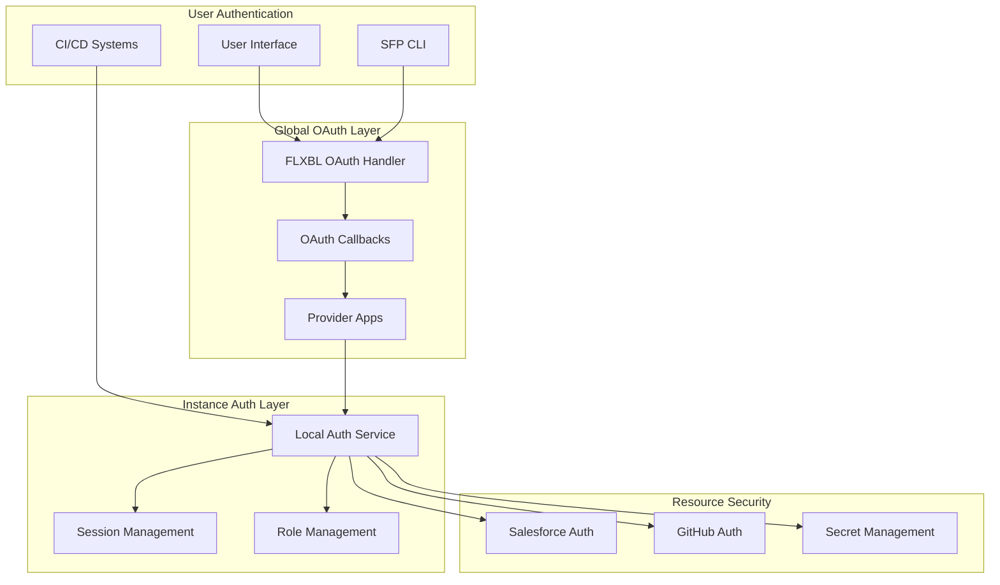
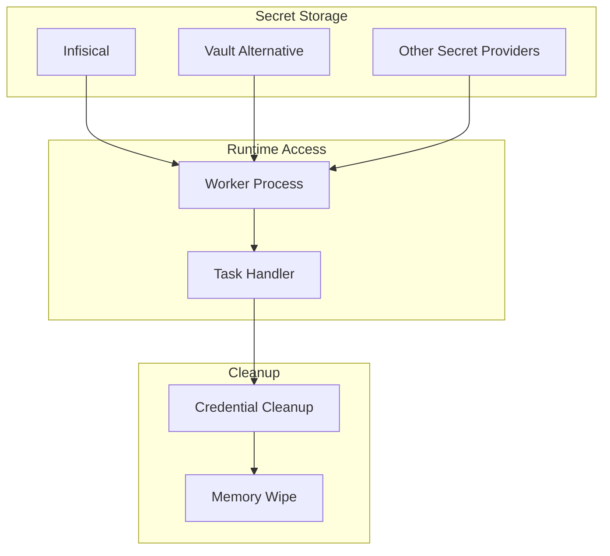
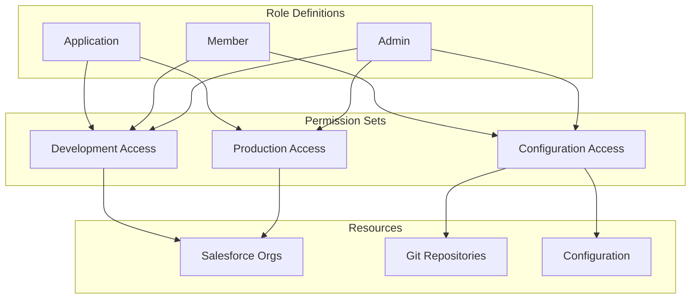

# Authentication & Security Architecture

The authentication system in sfp pro server addresses several complex challenges in Salesforce DevOps security. At its core, the system must secure not only user access but also manage machine-to-machine authentication for CI/CD systems, handle Salesforce credentials securely, and maintain complete isolation between different organizations.

### Authentication Layers

The system implements authentication through multiple coordinated layers, each handling specific aspects of security:

#### User Authentication Flow

Let's examine how authentication works for different types of users and systems:

1.  Interactive User Authentication (FLXBL-Managed Instances):

    This flow leverages FLXBL's registered OAuth applications, simplifying the setup for organizations. When a user authenticates:

    * The CLI initiates the OAuth process
    * FLXBL's global authentication service handles the OAuth callback
    * The user's identity is verified and passed to their instance
    * The instance creates and manages the user's session
2.  CI/CD System Authentication:

    CI/CD systems use application tokens that provide limited, scoped access:

    * Tokens are bound to specific instance and tenant
    * Each token has defined permission boundaries
    * Access is logged and auditable
    * Tokens can be revoked at any time
3. Self-Hosted Instance Authentication: In self-hosted environments, organizations manage their own OAuth applications:

#### Credential Security Architecture

One of the most critical aspects of the system is how it handles various credentials, particularly Salesforce organization credentials:

The system implements several key security principles:

1. Just-in-Time Secret Access: Credentials are only loaded when needed:
   * Workers fetch secrets at task start
   * Secrets remain only in memory
   * Credentials are cleared after task completion
   * No disk storage of sensitive data
2. Secure Secret Storage: All credentials are stored securely:
   * Encrypted at rest using tenant-specific keys
   * Accessible only through secure secret managers
   * Support for multiple secret management solutions
   * Regular secret rotation
3. Access Control: The system implements fine-grained access control:
   * Role-based access to credentials
   * Audit logging of all credential access
   * Restricted access to production credentials
   * Automated credential rotation support

#### Role and Permission Management

Each instance maintains its own role and permission system:

The permission system ensures:

* Clear separation of duties
* Principle of least privilege
* Granular access control
* Audit trail of all actions

#### Security Considerations

The authentication system addresses several key security requirements:

1. Tenant Isolation: Complete separation between organizations:
   * Independent authentication states
   * Separate credential storage
   * Isolated session management
   * No cross-tenant data access
2. Secure Communication: All communication is encrypted:
   * TLS for all API calls
   * Secure WebSocket connections
   * Encrypted credential transmission
   * Protected OAuth flows
3. Audit and Compliance: Comprehensive audit trails:
   * Authentication attempts logged
   * Credential access recorded
   * Session activity tracked
   * Security events monitored
4. Failure Handling: Secure failure modes:
   * Failed authentication logging
   * Credential access monitoring
   * Session timeout enforcement
   * Automated threat detection\\
