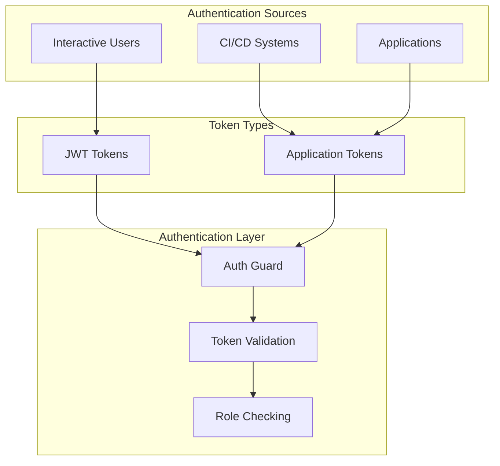
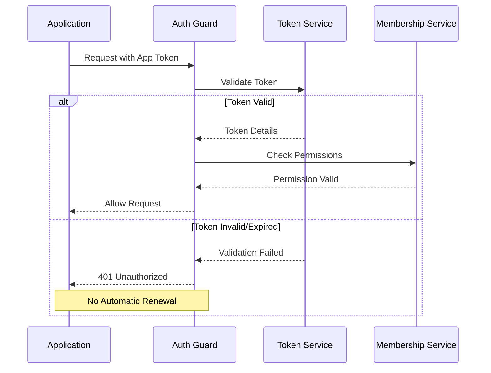
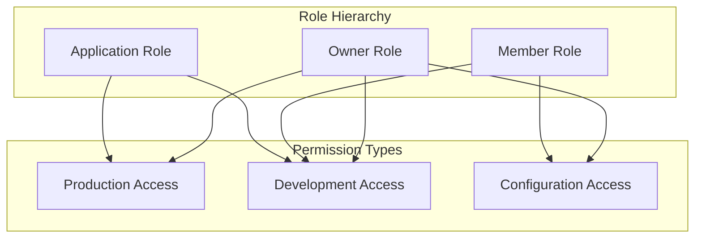
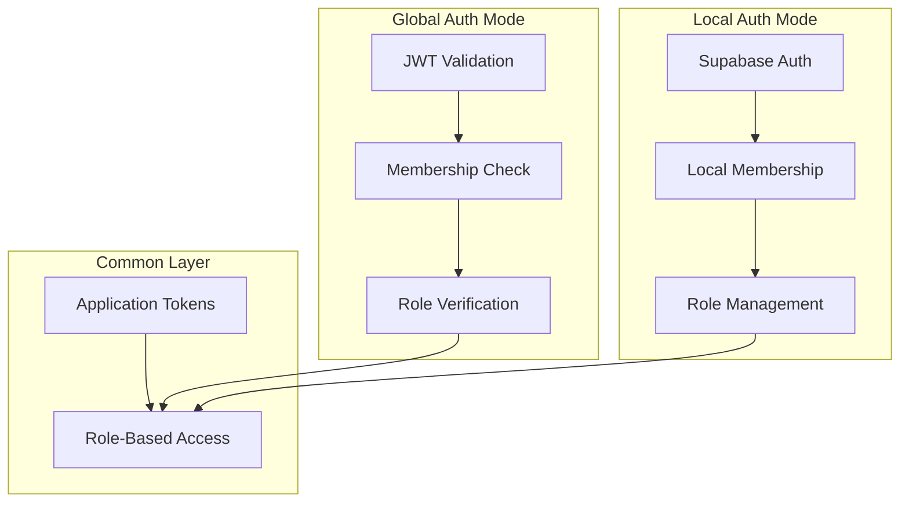

# Authentication System: Deep Dive

The authentication system in sfp pro server implements an approach to security that handles both interactive users and application tokens differently. Let's understand how this system works in detail, particularly focusing on the strict token handling approach that prioritizes security over convenience.

### Authentication Flows

The system supports two primary authentication paths, each with its own security considerations and handling patterns:

#### Interactive User Authentication

When a user authenticates through the UI or CLI, the system follows a chain of validations:

1. Token Validation:
   * Verifies JWT signature using the configured secret
   * Checks token expiration with a 5-minute buffer
   * Validates the token issuer and audience claims
2. Membership Verification:
   * Retrieves the user's personal account
   * Fetches associated memberships
   * Verifies role assignments
3. Role Authorization:
   * Implements a hierarchical role system ('member' → 'owner')
   * Validates required roles against user's assigned role
   * Enforces role-based access control on endpoints

#### Application Token Handling

The system takes a deliberately strict approach to application token management:

Key characteristics of this approach:

1. Strict Token Validation:
   * No automatic token renewal
   * Explicit rejection of expired tokens
   * Clear error messages indicating token status
2. Security-First Design:
   * Tokens must be manually rotated
   * No grace period for expired tokens
   * Clear audit trail of token usage
3. Clear Separation of Concerns:
   * Application tokens are distinct from user tokens
   * Different validation paths for each token type
   * Specific permissions for application tokens

### Role-Based Access Control

The system implements a sophisticated role-based access control system:

This role system ensures:

1. Clear permission boundaries
2. Hierarchical access control
3. Separate application permissions
4. Granular access management

### Implementation Patterns

The authentication system follows several key implementation patterns:

1. Early Validation: The AuthGuard performs token validation before any request processing begins. This ensures that:
   * Invalid requests are rejected immediately
   * No resources are wasted on unauthorized requests
   * Security checks are consistent across all endpoints
2. Layered Verification: Authentication happens in distinct layers:
3. Retry Management: The system implements sophisticated retry handling for database operations:
   * Configurable retry attempts for transient failures
   * Exponential backoff with randomization
   * Clear distinction between retryable and non-retryable errors
   * Comprehensive error logging for debugging
4. Error Handling: The system provides clear, secure error responses:
   * Generic errors for unauthenticated requests
   * Specific errors for authenticated users
   * No information leakage in error messages
   * Comprehensive error logging for administrators

### Global vs Local Authentication

The system supports both global and local authentication modes:

This dual-mode support enables:

1. Flexibility in deployment options
2. Consistent security model across modes
3. Clear separation of concerns
4. Support for both cloud and self-hosted scenarios

### Practical Implications

Understanding this authentication architecture has important implications for system usage:

1. For CI/CD Integration:
   * Plan for token rotation strategies
   * Implement proper error handling for token expiration
   * Consider using multiple tokens for different environments
   * Monitor token usage and expiration
2. For Application Development:
   * Implement proper token management
   * Handle authentication failures gracefully
   * Consider role requirements when designing integrations
   * Plan for token rotation in your application lifecycle
3. For System Administration:
   * Regular token audit and cleanup
   * Clear token provisioning processes
   * Monitoring of authentication patterns
   * Alert setup for suspicious activities

This strict approach to token management, while requiring more operational overhead, provides several security benefits:

* Clear token lifecycle
* No ambiguous token states
* Predictable security boundaries
* Easier security auditing
* Reduced attack surface
