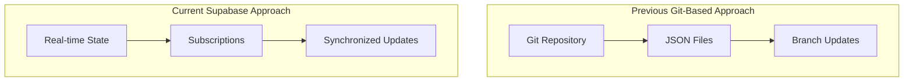

# Database Architecture

sfp pro server had  the following requirements that shaped the need for using Supabase as foundational system

1. Handle authentication and authorization seamlessly for both users and applications
2. Provide real-time state management to replace our previous Git-based approach
3. Work equally well in both cloud and self-hosted environments
4. Scale independently for each organization's needs
5. Ensure complete data isolation between organizations

### Authentication Foundation

Authentication in sfp pro server is built entirely on Supabase Auth, which provides several key advantages:

First, it offers built-in support for multiple authentication methods while maintaining a consistent security model. When users log in through OAuth providers (in FLXBL-managed instances) or through an organization's own authentication system (in self-hosted instances), Supabase Auth handles all the complexity of token management and session control.

Second, it provides a JWT-based authentication system that seamlessly integrates with both interactive users and automated systems. This means whether a request comes from a developer using the CLI, a CI/CD pipeline, or the Codev desktop application, the authentication flow remains consistent and secure.

### Instance Isolation

Each organization in sfp pro server receives its own dedicated Supabase instance. This architectural decision provides several benefits:

This isolation ensures that:

* Each organization's data remains completely separate
* Performance and scaling can be managed independently
* Security boundaries are enforced at the infrastructure level
* Organizations maintain control over their data governance

### Real-time State Management

One of the most significant improvements Supabase brings to sfp pro server is in state management. Previously, we stored state information in Git repositories, which led to several challenges:

* State updates required Git operations
* Real-time visibility was limited
* Concurrent updates were difficult to manage
* Performance was constrained by Git operations

Supabase's real-time capabilities transformed this approach:

This real-time capability enables:

* Immediate visibility into operation status
* Live updates without polling
* Efficient resource state tracking
* Consistent state management across all components

### Self-hosting Capabilities

The ability to self-host Supabase instances was crucial for organizations that need to maintain their systems within their own infrastructure. Supabase's open-source nature and comprehensive deployment tooling make this possible while maintaining feature parity with cloud deployments.

When an organization chooses to self-host sfp pro server, they get:

* Complete control over their Supabase instance
* The ability to integrate with internal systems
* Custom backup and retention policies
* Direct access to their data and logs

### The Evolution of State Management

The transition from Git-based state management to Supabase represents a fundamental improvement in how sfp pro server  handles operational state. Consider the example of managing a pool of Salesforce sandboxes:

In the previous approach, state changes required:

1. Cloning the repository
2. Reading state files
3. Making updates
4. Committing changes
5. Pushing updates
6. Handling conflicts

With Supabase, this becomes:

1. Subscribe to state changes
2. Receive real-time updates
3. Make atomic updates
4. Get immediate confirmation

This transformation has dramatically improved both system performance and reliability while simplifying the codebase and reducing operational complexity.

