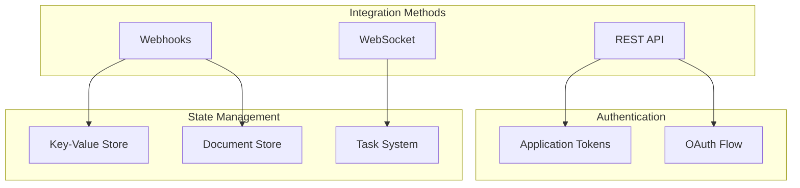
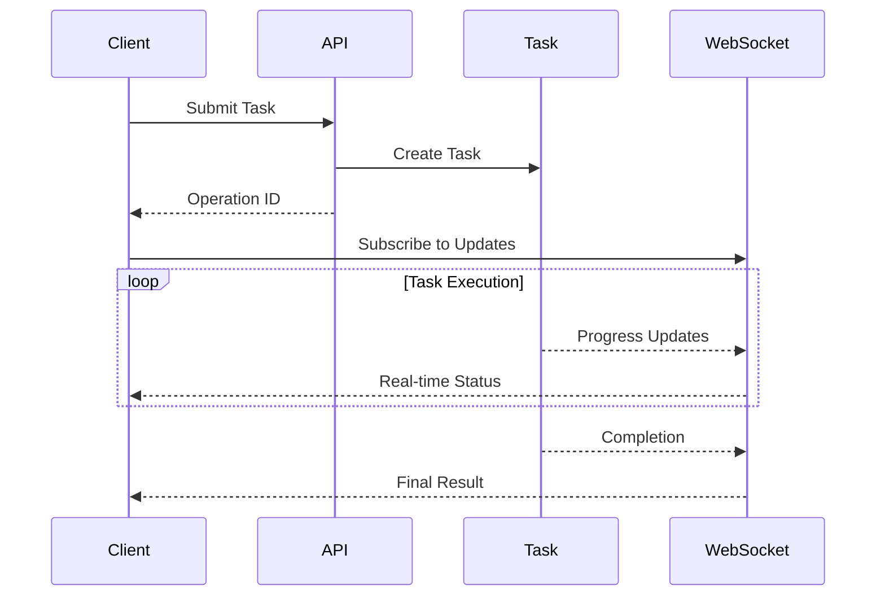
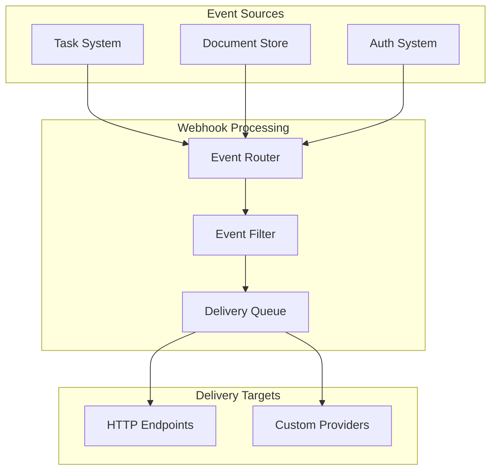

# Integration Architecture: Building Extensions

sfp proserver provides an integration architecture that enables external systems to interact with Salesforce DevOps operations. Understanding how to build integrations with the system requires understanding several key concepts and patterns.

### Understanding Integration Points

The system provides several primary integration mechanisms:



#### REST API Architecture

The REST API is the primary method for programmatic interaction with sfp proserver. It's designed around several core concepts:

1. Resource Organization: The API is organized into logical groupings:
   * Task Management (`/api/tasks`)
   * Salesforce Authentication (`/api/auth/salesforce`)
   * Document Management (`/api/doc-store`)
   * Key-Value Operations (`/api/key-value`)
   * Webhook Management (`/api/webhooks`)
2. Authentication Patterns: All API requests require authentication through:
   * OAuth-based tokens for interactive users
   * Application tokens for automated systems

#### Task System Integration

The task system is central to integration scenarios:



When integrating with the task system:

1. Task Creation: Submit tasks with appropriate priorities:
   * Critical for time-sensitive operations
   * Normal for standard operations
   * Batch for background processing
2. Status Monitoring: Track task progress through either:
   * WebSocket connections for real-time updates
   * REST API polling for simpler integrations
3. Result Handling: Process task results based on operation type:
   * Direct results for quick operations
   * Staged results for long-running tasks
   * Error handling for failed operations

#### Webhook System

The webhook system enables event-driven integration patterns:



The webhook system provides:

1. Event Configuration:
   * Define webhook endpoints
   * Configure event filters
   * Set retry policies
   * Manage security headers
2. Delivery Management:
   * Asynchronous event delivery
   * Automatic retries
   * Delivery status tracking
   * Error handling

#### Document Store Integration

The document store provides a flexible system for managing complex state:

1. Collection Organization:
   * Hierarchical document organization
   * Cross-collection queries
   * Version tracking
   * Optimistic concurrency
2.  Query Capabilities:

    ```mermaid
    graph TD
        subgraph "Query System"
            Path[Path Patterns]
            Filter[Filter Rules]
            Sort[Sort Options]
            Paginate[Pagination]
        end

        Path --> Query
        Filter --> Query
        Sort --> Query
        Paginate --> Query

        Query --> Results
    ```

#### Building Integrations

When building integrations with sfp pro server, consider these patterns:

1.  Authentication Flow:

    ```mermaid
    sequenceDiagram
        participant App
        participant SFP
        participant Token

        App->>SFP: Create Application Token
        SFP->>Token: Generate Token
        Token-->>App: Token Details

        Note over App,Token: Store Token Securely

        App->>SFP: API Request with Token
        SFP->>SFP: Validate Token
        SFP-->>App: Response
    ```
2. Operation Patterns: Choose the appropriate integration pattern:
   * Synchronous for quick operations
   * Asynchronous for long-running tasks
   * Event-driven for state changes
   * WebSocket for real-time updates
3. Error Handling: Implement robust error handling:
   * Token expiration handling
   * Task failure recovery
   * Network resilience
   * Rate limiting compliance

#### Common Integration Scenarios

Let's examine some common integration patterns:

1.  CI/CD Integration:

    ```mermaid
    sequenceDiagram
        participant CI
        participant SFP
        participant SF

        CI->>SFP: Submit Deployment Task
        SFP->>SF: Deploy Changes

        loop Status Check
            CI->>SFP: Check Progress
            SFP-->>CI: Update Status
        end

        SF-->>SFP: Deployment Complete
        SFP-->>CI: Final Result
    ```
2.  Environment Management:

    ```mermaid
    sequenceDiagram
        participant App
        participant SFP
        participant Pool

        App->>SFP: Request Environment
        SFP->>Pool: Allocate Environment
        Pool-->>SFP: Environment Details
        SFP-->>App: Access Information

        Note over App,Pool: Environment Active

        App->>SFP: Release Environment
        SFP->>Pool: Return to Pool
    ```
3.  State Synchronization:

    ```mermaid
    sequenceDiagram
        participant System
        participant SFP
        participant Store

        System->>SFP: Register Webhook

        loop State Changes
            Store->>SFP: State Update
            SFP->>System: Webhook Delivery
            System-->>SFP: Acknowledge
        end
    ```

#### Security Considerations

When building integrations, observe these security practices:

1. Token Management:
   * Rotate application tokens regularly
   * Use scoped tokens for specific operations
   * Implement secure token storage
   * Monitor token usage
2. Webhook Security:
   * Validate webhook signatures
   * Use HTTPS endpoints
   * Implement request timeouts
   * Filter sensitive data
3. Error Handling:
   * Handle authentication failures gracefully
   * Implement retry mechanisms
   * Log security events
   * Monitor for unusual patterns
