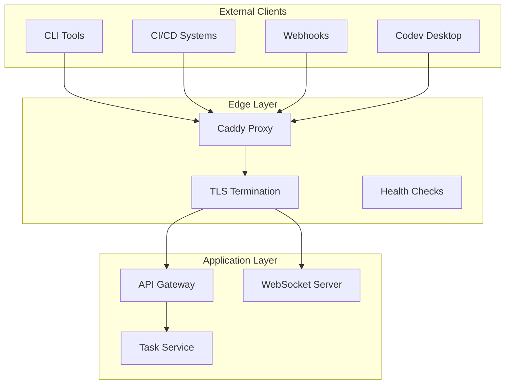
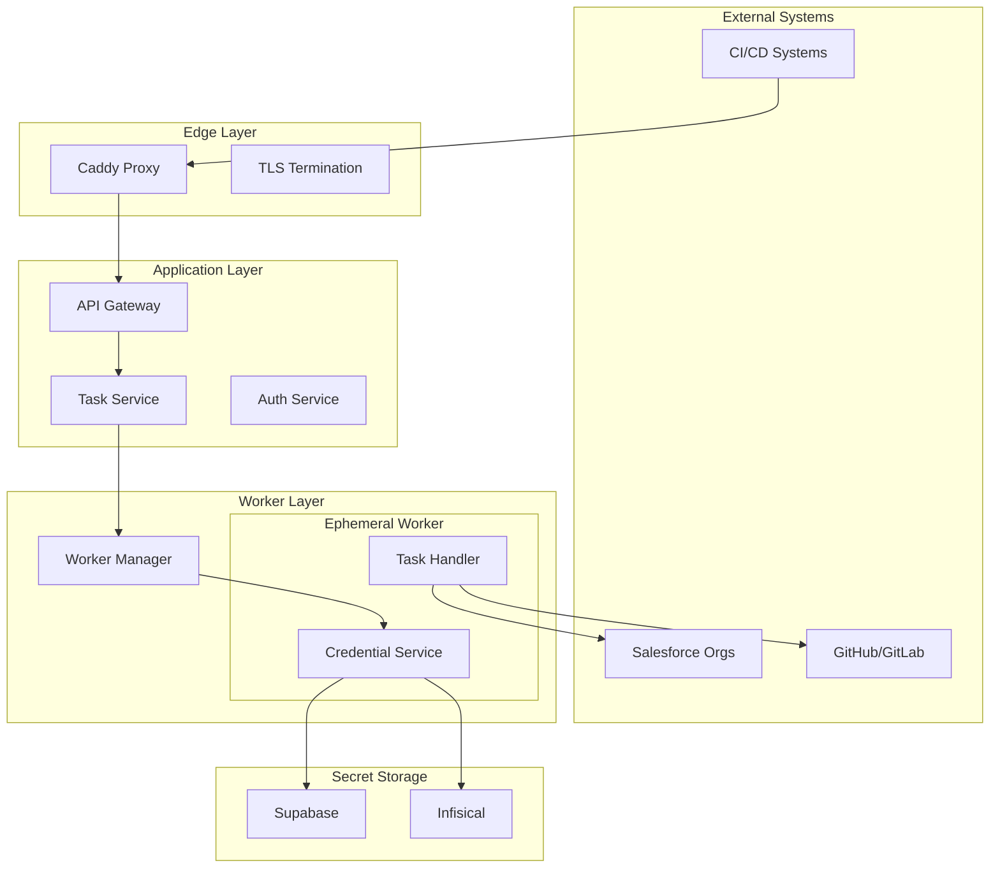
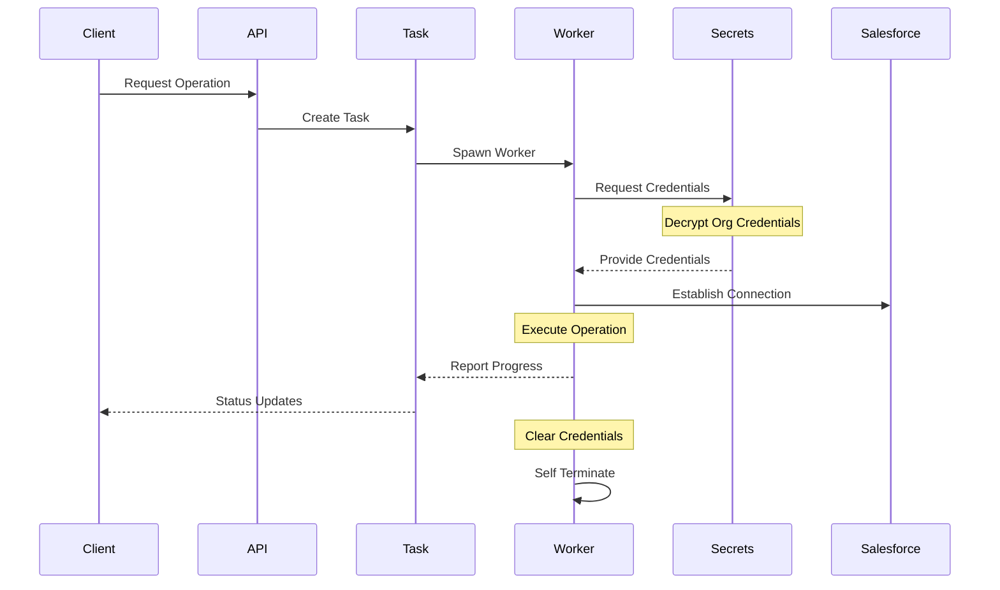
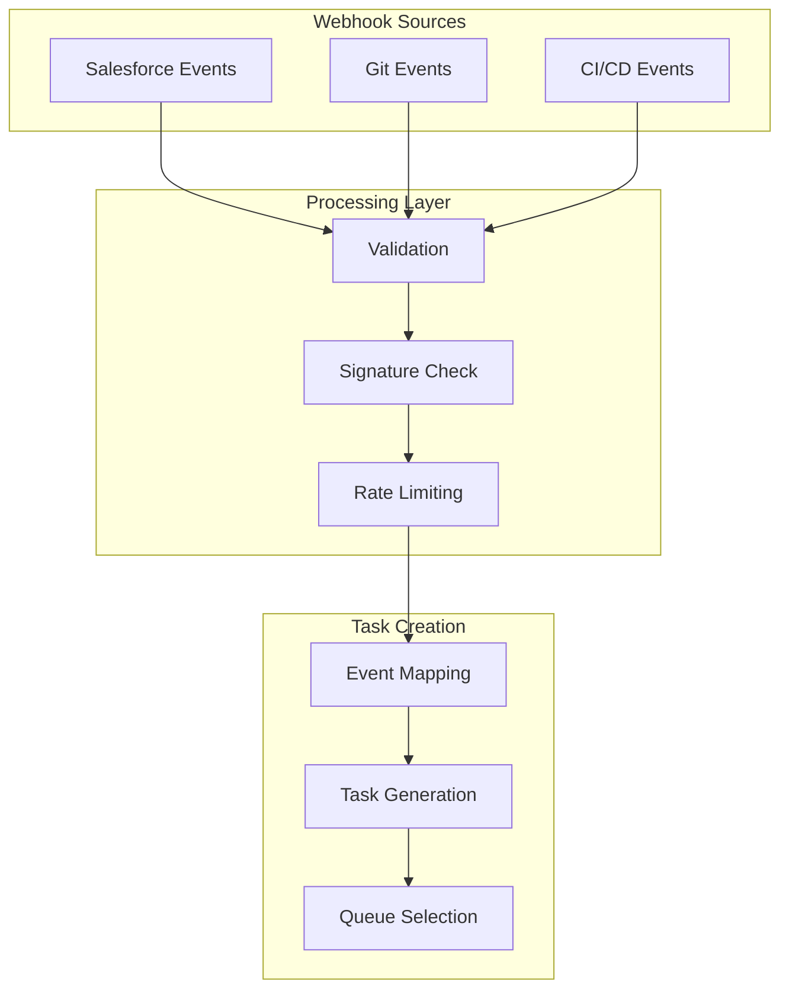
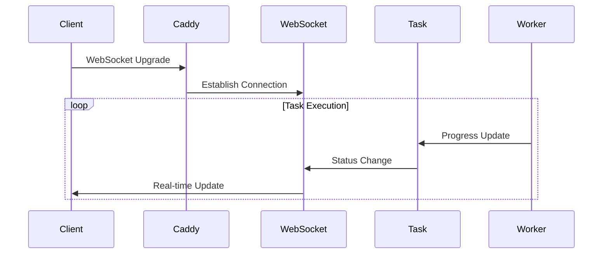

# Network Architecture and Integration System

## Understanding Network Design

The network architecture of sfp pro server addresses a fundamental challenge in Salesforce DevOps: How do we securely connect various clients and systems to Salesforce while maintaining strict security boundaries and ensuring efficient operations? This challenge becomes even more complex when we consider that the system must handle multiple types of connections simultaneously - from CLI tools, CI/CD systems, webhooks, and long-running deployment operations.

### Edge Layer: The Role of Caddy

At the entry point of every sfp pro server instance sits Caddy, serving as both a reverse proxy and security gateway. Think of Caddy as the system's front door - it's where all external connections first arrive and are properly routed to their destinations.

Caddy performs several crucial functions that form our first line of defense:

First, it handles all TLS termination, managing certificates automatically whether in FLXBL-managed or self-hosted environments. This ensures all communications are encrypted using modern TLS protocols and cipher suites.

Second, it provides intelligent request routing. When a request arrives, Caddy determines whether it should go to the API service, the WebSocket server for real-time updates, or be handled as a webhook. This routing happens based on the request type and path, ensuring each request reaches the appropriate service.

Third, it implements our first layer of security controls, including rate limiting, basic DDoS protection, and HTTP header standardization. These protections help ensure system stability and security before requests even reach our application layer.

### Integration Architecture

The integration system in sfp pro server needs to handle several distinct types of communication patterns. Let's examine how these work together:

#### Secure Salesforce Integration

The most critical integration point in our system is with Salesforce organizations. When a task needs to interact with Salesforce, whether for a deployment, metadata retrieval, or org validation, the system follows a carefully orchestrated process:

This process ensures complete security of Salesforce credentials through several key mechanisms:

First, credentials are never stored in the application layer. Instead, they're securely stored in our secret management system and only accessed when needed for specific operations.

Second, when a worker needs to connect to Salesforce, it receives just-in-time credentials that exist only in memory. These credentials are immediately cleared when the operation completes, and the worker process terminates.

Third, each operation gets its own isolated worker process, ensuring that credential access is completely separated between different operations and organizations.

#### Webhook Management

The webhook system handles incoming events from various sources, including Salesforce platform events, GitHub/GitLab notifications, and CI/CD system callbacks. Here's how this process works:

When a webhook arrives:

1. Caddy performs initial validation and TLS termination
2. The webhook handler verifies the source's signature
3. The system maps the event to appropriate tasks
4. Tasks are created with appropriate priorities

#### Real-time Updates

The system provides real-time visibility into operations through a WebSocket-based update system. This enables clients to monitor long-running operations, receive immediate status updates, and track resource utilization in real-time.

The WebSocket connections are managed through the same secure edge layer, ensuring consistent security policies and access controls:

