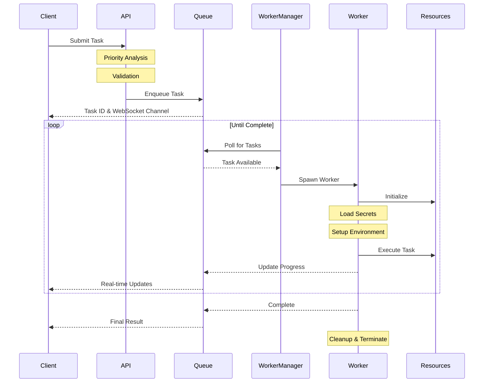
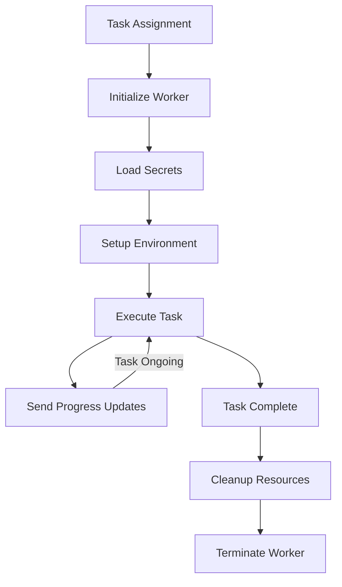
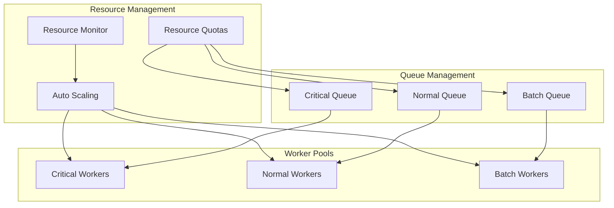

# Task Processing System

The task processing system in sfp pro server is designed to handle operations ranging from quick metadata validations to long-running deployments. Understanding how this system works is crucial because it forms the core of how work gets done in the platform.

### Task Lifecycle

When a user or CI/CD system initiates an operation, it begins a journey through several stages of processing. Let's examine this journey in detail:

### Task Classification and Priority

Every task in sfp pro server is assigned to one of three processing queues based on its characteristics:

1.  Critical Queue These tasks demand immediate attention and quick processing. They typically involve operations that developers are actively waiting on. For example:

    * Code linting operations
    * Quick metadata validations
    * Configuration checks

    Critical tasks receive dedicated worker capacity and are processed ahead of other queues. This ensures developers get immediate feedback for operations that block their work.
2.  Normal Queue The standard processing queue handles most day-to-day development operations. These tasks include:

    * Package installations
    * Deployment validations
    * Environment preparations
    * Source tracking operations

    Normal queue tasks are processed with fair scheduling, ensuring all teams get reasonable response times while managing system resources efficiently.
3.  Batch Queue This queue is designed for resource-intensive, long-running operations that don't require immediate completion. Examples include:

    * Full test suite executions
    * Bulk data operations
    * Nightly builds
    * Complete org validations

    Batch tasks can be preempted by higher priority work and are often scheduled during off-peak hours to maximize resource utilization.

#### Worker Lifecycle

Each worker in sfp pro server follows a strict lifecycle that ensures security and reliability:

1. Initialization Phase
   * Worker process spawns in a clean environment
   * No inherited state or resources
   * Fresh memory space allocation
   * Temporary workspace creation
2. Secret Loading The worker securely loads required credentials:
   * Salesforce org credentials
   * GitHub tokens
   * Other necessary secrets All secrets are loaded just-in-time and held only in memory.
3. Environment Setup
   * Prepares necessary tools and dependencies
   * Configures connection parameters
   * Sets up logging channels
   * Initializes progress reporting
4. Task Execution During execution, the worker:
   * Processes the assigned task
   * Reports progress through WebSocket channels
   * Manages resource utilization
   * Handles any necessary retries
5. Completion and Cleanup After task completion:
   * All secrets are cleared from memory
   * Temporary files are securely removed
   * Resources are released
   * Worker process terminates completely

This ephemeral worker model provides several key benefits:

* Complete isolation between tasks
* No credential persistence
* Clean state for each operation
* Predictable resource cleanup

#### Resource Management

The task processing system includes sophisticated resource management to ensure system stability and fair resource allocation:

1. Worker Pool Management Each queue type has its own worker pool:
   * Critical pool maintains minimum available workers
   * Normal pool scales based on demand
   * Batch pool uses excess capacity
2. Resource Quotas The system enforces quotas at multiple levels:
   * Per-tenant resource limits
   * Queue-specific allocations
   * Individual task resource boundaries
3. Dynamic Scaling Worker pools scale based on:
   * Current workload
   * Queue depths
   * Resource availability
   * Priority requirements

### Error Handling and Recovery

The task processing system implements robust error handling to maintain reliability:

1. Task Failure Handling When a task fails, the system:
   * Captures detailed error information
   * Provides error context through WebSocket updates
   * Maintains failure state for analysis
   * Cleans up any partial changes
2. Worker Failure Recovery If a worker fails unexpectedly:
   * The task is marked as failed
   * Resources are forcefully cleaned up
   * Client is notified of the failure
   * System maintains audit trail
3. Queue Recovery During system restarts or failures:
   * Queue state is preserved
   * Incomplete tasks are requeued
   * Progress information is maintained
   * Clients can reconnect to existing tasks

The error handling mechanism ensures that system stability is maintained even during unexpected failures, while providing clear feedback to users about any issues that arise.
