# Validation Scripts

|              | sfp-pro     | sfp (community) |
| ------------ | ----------- | --------------- |
| Availability | ✅           | ✅               |
| From         | Aug 25 - 02 | December 25     |

Validation scripts allow you to execute custom logic at specific points during the validation process. These global-level scripts provide hooks for setup, cleanup, reporting, and integration with external systems during validation workflows.

### Validation Pipeline Execution

### Configuration

```mermaid
flowchart TD
    A[Validation Started] --> B[Fetch/Create Target Org]
    B --> C[Compute Impacted Packages]
    C --> D[Build Impacted Packages]
    D --> E[🔧 PRE-VALIDATION SCRIPT]
    E --> F[Deploy Packages to Target Org]
    F --> G[Run Apex Tests]
    G --> H[Validate Coverage]
    H --> I{Validation Result}
    I -->|Success| J[🏁 POST-VALIDATION SCRIPT]
    I -->|Failure| K[🏁 POST-VALIDATION SCRIPT]
    J --> L[Generate Reports]
    K --> L
    L --> M[Cleanup Resources]
    
    style E fill:#e1f5fe,stroke:#0277bd,stroke-width:2px
    style J fill:#e8f5e8,stroke:#2e7d32,stroke-width:2px
    style K fill:#ffebee,stroke:#c62828,stroke-width:2px
```



Add script paths to your `sfdx-project.json` file:

```json
{
  "plugins": {
    "sfp": {
      "validateScripts": {
        "preValidation": "./scripts/pre-validate.sh",
        "postValidation": "./scripts/post-validate.sh"
      }
    }
  }
}
```

### Script Arguments

Scripts receive three arguments in this order:

1. **Context File Path** - Absolute path to temporary JSON file containing validation context
2. **Target Org** - Username of the target organization for validation
3. **Hub Org** - Username of the hub organization (empty string `""` if not available)

```bash
# Example script invocation:
./scripts/pre-validate.sh /tmp/sfp-validate-pre-1234567890.json scratch-org-user@example.com devhub@example.com
```

### Context Data Structure

#### Pre-Validation Context

The context file contains information about packages ready for validation:

```json
{
  "phase": "pre-validation",
  "targetOrg": "scratch-org-username",
  "hubOrg": "devhub-username",
  "validationMode": "thorough",
  "packages": [
    {
      "name": "core-crm",
      "version": "2.1.0.NEXT", 
      "type": "source",
      "isChanged": true
    }
  ]
}
```

#### Post-Validation Context

The context file includes all pre-validation data plus validation results:

```json
{
  "phase": "post-validation",
  "targetOrg": "scratch-org-username",
  "hubOrg": "devhub-username",
  "validationMode": "thorough",
  "packages": [/* same as pre-validation */],
  "validationResults": {
    "status": "success",
    "deployedPackages": ["core-crm", "shared-utils"],
    "failedPackages": [],
    "error": undefined
  }
}
```

### Example Scripts

#### Pre-Validation Script

```bash
#!/bin/bash
set -e

CONTEXT_FILE="$1"
TARGET_ORG="$2"
HUB_ORG="$3"

echo "🔧 Pre-validation setup starting..."

# Parse context
PACKAGES=$(cat "$CONTEXT_FILE" | jq -r '.packages[].name' | tr '\n' ' ')
VALIDATION_MODE=$(cat "$CONTEXT_FILE" | jq -r '.validationMode')

echo "📦 Packages to validate: $PACKAGES"
echo "🎯 Validation mode: $VALIDATION_MODE"
echo "🏢 Target org: $TARGET_ORG"

# Custom setup logic
if [ "$VALIDATION_MODE" = "thorough" ]; then
    echo "🔧 Setting up comprehensive validation environment..."
    # Setup test data, configure external systems, etc.
fi

# Example: Notify external systems
curl -X POST "https://internal-api.company.com/validation/started" \
     -H "Content-Type: application/json" \
     -d "{\"packages\": \"$PACKAGES\", \"targetOrg\": \"$TARGET_ORG\"}"

echo "✅ Pre-validation setup completed"
```

#### Post-Validation Script

```bash
#!/bin/bash
CONTEXT_FILE="$1"
TARGET_ORG="$2"
HUB_ORG="$3"

echo "🏁 Post-validation processing starting..."

# Parse results
STATUS=$(cat "$CONTEXT_FILE" | jq -r '.validationResults.status')
DEPLOYED=$(cat "$CONTEXT_FILE" | jq -r '.validationResults.deployedPackages[]' | tr '\n' ' ')
FAILED=$(cat "$CONTEXT_FILE" | jq -r '.validationResults.failedPackages[]' | tr '\n' ' ')

echo "📊 Validation status: $STATUS"
echo "✅ Deployed packages: $DEPLOYED"

if [ "$STATUS" = "failed" ]; then
    echo "❌ Failed packages: $FAILED"
    ERROR=$(cat "$CONTEXT_FILE" | jq -r '.validationResults.error // "Unknown error"')
    echo "🔍 Error details: $ERROR"
    
    # Notify failure
    curl -X POST "https://internal-api.company.com/validation/failed" \
         -H "Content-Type: application/json" \
         -d "{\"error\": \"$ERROR\", \"failedPackages\": \"$FAILED\"}"
else
    echo "🎉 Validation successful!"
    
    # Notify success  
    curl -X POST "https://internal-api.company.com/validation/success" \
         -H "Content-Type: application/json" \
         -d "{\"deployedPackages\": \"$DEPLOYED\"}"
fi

echo "✅ Post-validation processing completed"
```

### Error Handling & Behavior

| Script Type         | Failure Behavior                        | Timeout    | Use Cases                                                       |
| ------------------- | --------------------------------------- | ---------- | --------------------------------------------------------------- |
| **Pre-validation**  | Halts validation process                | 30 minutes | Setup test data, configure environments, validate prerequisites |
| **Post-validation** | Logged as warning, validation continues | 30 minutes | Cleanup resources, send notifications, generate reports         |

### Best Practices

* **Make scripts executable**: `chmod +x scripts/pre-validate.sh`
* **Use set -e**: Exit on errors to ensure proper failure handling
* **Parse JSON safely**: Use `jq` for reliable JSON parsing
* **Handle missing data**: Check if fields exist before using them
* **Log clearly**: Scripts appear in validation logs with CI/CD folding
* **Keep scripts fast**: Remember the 30-minute timeout limit
* **Test locally**: Validate script behavior before committing

### Common Use Cases

#### Pre-Validation Scripts

* Set up test data specific to validation scenarios
* Configure external API endpoints for testing
* Validate prerequisites (licenses, feature flags, etc.)
* Initialize monitoring or logging for the validation process

#### Post-Validation Scripts

* Clean up test data created during validation
* Send notifications to Slack, Teams, or other systems
* Generate custom reports or metrics
* Update external tracking systems with validation results
* Archive validation artifacts or logs
